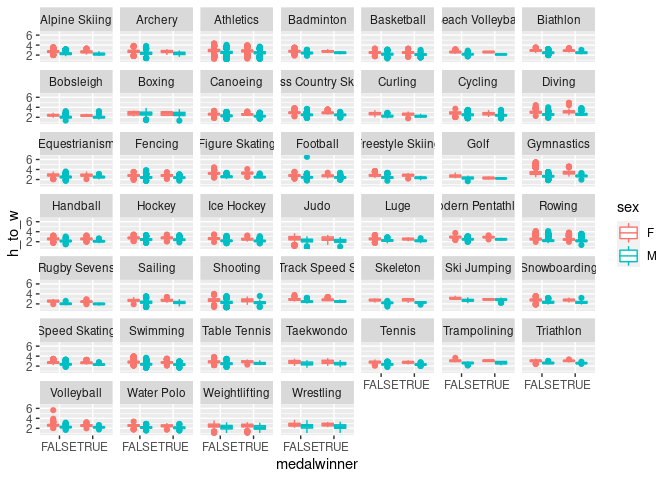

Project title
================
by Team name

    ## Warning in system("timedatectl", intern = TRUE): running command 'timedatectl'
    ## had status 1

    ## ── Attaching packages ─────────────────────────────────────── tidyverse 1.3.1 ──

    ## ✓ ggplot2 3.3.5     ✓ purrr   0.3.4
    ## ✓ tibble  3.1.4     ✓ dplyr   1.0.7
    ## ✓ tidyr   1.1.3     ✓ stringr 1.4.0
    ## ✓ readr   2.0.1     ✓ forcats 0.5.1

    ## ── Conflicts ────────────────────────────────────────── tidyverse_conflicts() ──
    ## x dplyr::filter() masks stats::filter()
    ## x dplyr::lag()    masks stats::lag()

    ## Rows: 271116 Columns: 15

    ## ── Column specification ────────────────────────────────────────────────────────
    ## Delimiter: ","
    ## chr (10): name, sex, team, noc, games, season, city, sport, event, medal
    ## dbl  (5): id, age, height, weight, year

    ## 
    ## ℹ Use `spec()` to retrieve the full column specification for this data.
    ## ℹ Specify the column types or set `show_col_types = FALSE` to quiet this message.

## Introduction

(1-2 paragraphs) Brief introduction to the dataset. You may repeat some
of the information about the dataset provided in the introduction to the
dataset on the TidyTuesday repository, paraphrasing on your own terms.
Imagine that your project is a standalone document and the grader has no
prior knowledge of the dataset.

## Question 1 \<- Update title to relate to the question you’re answering

### Introduction

(1-2 paragraphs) Introduction to the question and what parts of the
dataset are necessary to answer the question. Also discuss why you’re
interested in this question.

### Approach

(1-2 paragraphs) Describe what types of plots you are going to make to
address your question. For each plot, provide a clear explanation as to
why this plot (e.g. boxplot, barplot, histogram, etc.) is best for
providing the information you are asking about. The two plots should be
of different types, and at least one of the two plots needs to use
either color mapping or facets.

### Analysis

``` r
## Evan

# Get vector of sports to keep: ie. those that have at least 5 observations per gender
sports_to_keep <- olympics %>%
  group_by(sport, sex) %>%
  summarise(n_per_gender = n()) %>%
  filter(n_per_gender > 5) %>%
  summarise(genders_per_sport = n()) %>%
  filter(genders_per_sport == 2) %>%
  select(sport) %>%
  pull()
```

    ## `summarise()` has grouped output by 'sport'. You can override using the `.groups` argument.

``` r
# Remove all observations from data frame except those from the desired sports we identified above. We also need to remove Croquet and Art Competitions, as those data do not have height or weight measurements.
olympics_evan <- olympics %>%
  filter(sport %in% sports_to_keep) %>%
  filter(!(sport %in% c("Croquet", "Art Competitions")))

# Also im just going to keep summer sports to try to reduce visual overload
#olympics_evan <- olympics_evan %>%
  #filter(season == "Summer")

# Create new needed variables
olympics_evan <- olympics_evan %>%
  mutate(medalwinner = if_else(is.na(medal), FALSE, TRUE),
         h_to_w = height / weight)

# Create plot to examine height to weight ratios and how they vary between sexes and medalwinners and non-medalwinners, and then comparing these trends across sports
ggplot(olympics_evan, mapping = aes(x = medalwinner, y = h_to_w)) +
  geom_boxplot(aes(color = sex)) +
  facet_wrap(vars(sport))
```

    ## Warning: Removed 59676 rows containing non-finite values (stat_boxplot).

<!-- -->

``` r
#TODOS: see what's going on with ice hockey (looks like only males, and only medalwinners) and figure skating (looks like only medalwinners, but both sexes are still represented.)

olympics %>%
  filter(sport == "Beach Volleyball" | sport == "Volleyball") %>%
  mutate(h_to_w = height / weight) %>%
  group_by(sex, year) %>%
  summarise(mean_h_to_w = mean(h_to_w, na.rm = TRUE),
            mean_height = mean(height, na.rm = TRUE),
            mean_weight = mean(weight, na.rm = TRUE)) %>%
  ggplot(mapping = aes(x = year, group = sex, linetype = sex)) +
    geom_line(aes(y = mean_h_to_w), color = "purple") +
    geom_line(aes(y = mean_height), color = "blue") +
    geom_line(aes(y = mean_weight), color = "green") +
    geom_vline(xintercept = c(1984, 1992), color = "red")
```

    ## `summarise()` has grouped output by 'sex'. You can override using the `.groups` argument.

<!-- -->

(2-3 code blocks, 2 figures, text/code comments as needed) In this
section, provide the code that generates your plots. Use scale functions
to provide nice axis labels and guides. You are welcome to use theme
functions to customize the appearance of your plot, but you are not
required to do so. All plots must be made with ggplot2. Do not use base
R or lattice plotting functions.

### Discussion

(1-3 paragraphs) In the Discussion section, interpret the results of
your analysis. Identify any trends revealed (or not revealed) by the
plots. Speculate about why the data looks the way it does.

## Question 2 \<- Update title to relate to the question you’re answering

### Introduction

(1-2 paragraphs) Introduction to the question and what parts of the
dataset are necessary to answer the question. Also discuss why you’re
interested in this question.

### Approach

(1-2 paragraphs) Describe what types of plots you are going to make to
address your question. For each plot, provide a clear explanation as to
why this plot (e.g. boxplot, barplot, histogram, etc.) is best for
providing the information you are asking about. The two plots should be
of different types, and at least one of the two plots needs to use
either color mapping or facets.

### Analysis

(2-3 code blocks, 2 figures, text/code comments as needed) In this
section, provide the code that generates your plots. Use scale functions
to provide nice axis labels and guides. You are welcome to use theme
functions to customize the appearance of your plot, but you are not
required to do so. All plots must be made with ggplot2. Do not use base
R or lattice plotting functions.

### Discussion

(1-3 paragraphs) In the Discussion section, interpret the results of
your analysis. Identify any trends revealed (or not revealed) by the
plots. Speculate about why the data looks the way it does.

## Presentation

Our presentation can be found [here](presentation/presentation.html).

## Data

Include a citation for your data here. See
<http://libraryguides.vu.edu.au/c.php?g=386501&p=4347840> for guidance
on proper citation for datasets. If you got your data off the web, make
sure to note the retrieval date.

## References

List any references here. You should, at a minimum, list your data
source.
