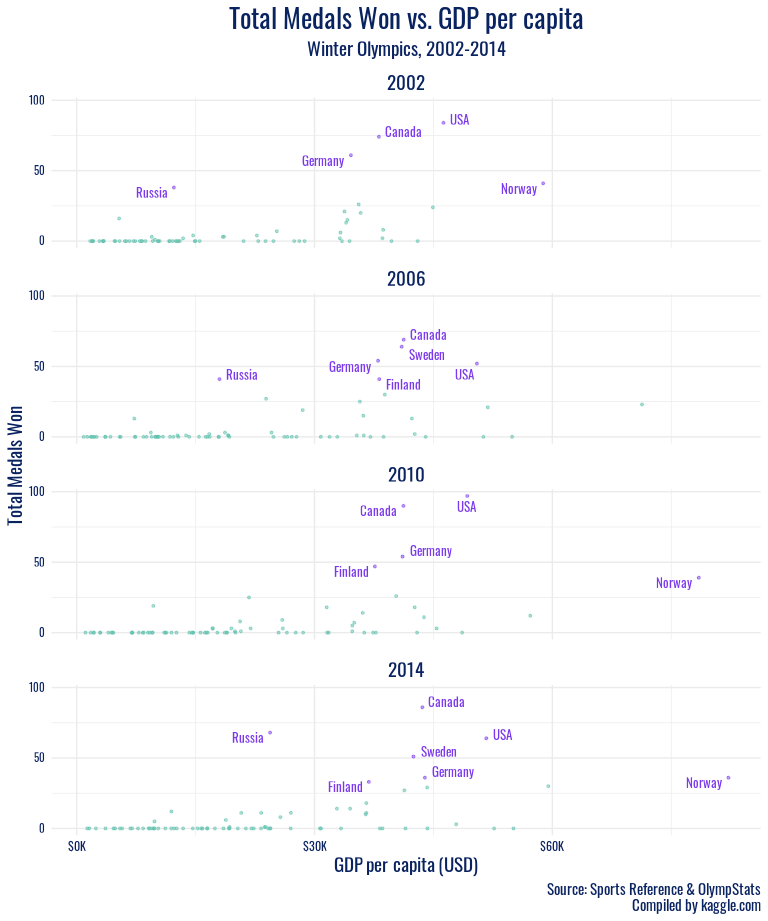
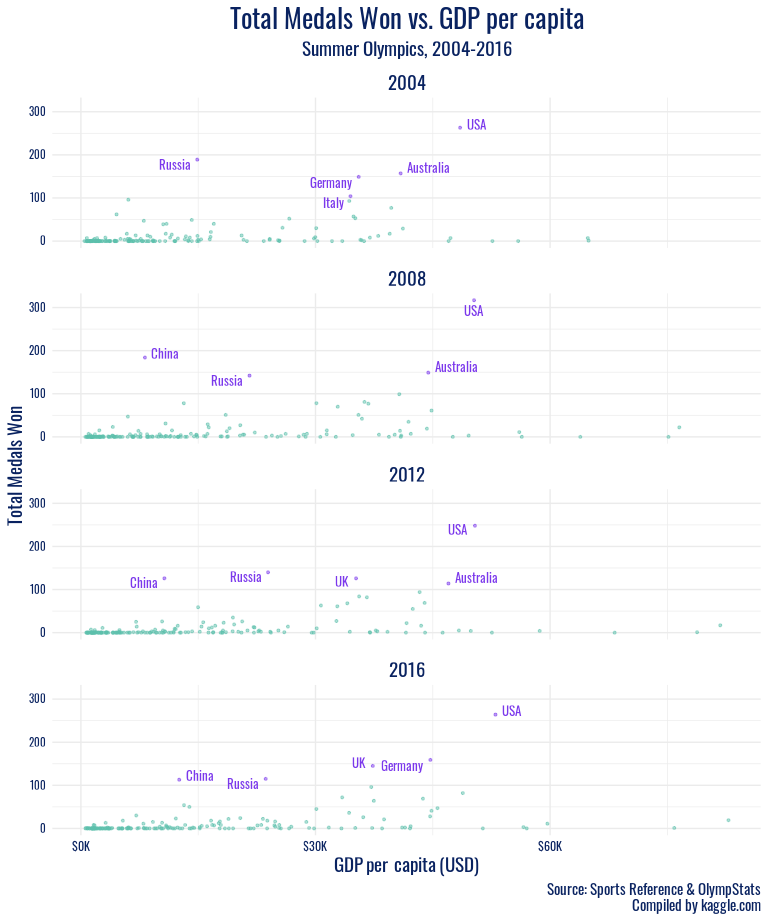

Beyond the Rings: Analyzing Olympic Athlete and Medal-Winning Country
Characteristics
================
by Mr. Palmer’s Penguins

Loading the packages we need for the project.

``` r
# load packages here
suppressPackageStartupMessages(library(lubridate))
suppressPackageStartupMessages(library(gganimate))
suppressPackageStartupMessages(library(ggrepel))
suppressPackageStartupMessages(library(plyr))
suppressPackageStartupMessages(library(gifski))
suppressPackageStartupMessages(library(dplyr))
suppressPackageStartupMessages(library(scales))
suppressPackageStartupMessages(library(tidyverse))
suppressPackageStartupMessages(library(showtext)) # cool fonts
suppressPackageStartupMessages(library(magrittr))
suppressPackageStartupMessages(library(ggtext)) # superscript in plot labels
suppressPackageStartupMessages(library(styler))
```

Loading the data CSV from the `data` folder:

``` r
# load data here
olympics <- read_csv(file = paste0(here::here(), "/data/olympics_data.csv"), show_col_types = FALSE)
```

Setting the universal chunk options:

``` r
knitr::opts_chunk$set(fig.width = 8, fig.asp = 0.618, out.width = "80%")
```

## Introduction

The set, which includes 15 variables and 271116 observations, provides
insight into the athletes that competed in and the results of the
Olympic games from Athens 1896 to Rio 2016. Each observation includes
information about an athlete on a per event basis. Therefore, if an
athlete competes in multiple different events, there will be multiple
different observations reflecting each event an individual participated
in. Each observation details medal results (Gold, Silver, Bronze, or
NA), the athlete’s background (age, sex, height, weight, team they’re
competing for, etc.), and context about the event (where and when it was
held, season, sport the athlete competes in, etc.). We chose this
dataset because we think it can provide a lot of good insights into some
of the trends at the Olympics over the past century.

This dataset was accessed on
[kaggle.com](https://www.kaggle.com/heesoo37/120-years-of-olympic-history-athletes-and-results)
and includes data scraped in May 2018 from Sports Reference/OlympStats,
sports statistics sites, by Randi Griffin, a Senior Data Scientist at
Boston Consulting Group. Moreover, it was selected as part of the
[TidyTuesday](https://github.com/rfordatascience/tidytuesday/tree/master/data/2021#readme7c70d95441aec295a1e92da9d71e2872877d663c)
challenge on 7/27/21.

## Understanding Physical Characteristics of Olympians

### Introduction

For this section, we hope to answer the question: do certain physical
characteristics (such as body mass index with `height` and `weight`,
`age`, and `sex`) of Olympic participants differ by `sport` and/or
change with time (`year`)?

The Olympic Games are a unique opportunity for diverse and talented
individuals to showcase their skills across a variety of disciplines. As
a result, we are interested in better understanding how the diversity of
physical characteristics in the set of competing athletes potentially
differs by sport and/or has changed with time. Three physical
characteristics of interest are body mass index (a factor that takes
`height` and `weight` into account), `sex`, and `age`. It’s often the
case that the media/press discuss these physical characteristics as key
metrics when describing athletes. Therefore, we are curious about better
understanding the extent to which these differ (if at all).

Firstly, we are hoping to understand if the optimal build of an Olympic
athlete differs by `sex` and/or by `sport`. For example, we suspect that
a high performing male Olympic wrestler is more likely to have a
different build than a typical female gymnast. Therefore, we hypothesize
that there may be different optimal heights and weights for successful
athletes of different sexes and depending on the sport.

Secondly, we will assess if the mean age of Olympic participants has
changed over time for each `sex`. In the 2020 Olympics, there was a lot
of media attention on younger Olympians. Therefore, we are curious how
the mean age of participants has changed over time. With `age` being a
key physical characteristic, we think this will add another key
dimension to gaining a better understanding of the athletes
participating.

### Approach

For our first plot, we plan to use boxplots to plot the distribution of
a size characteristic by `sex` (since characteristics tend to differ
among males and females) and faceting by `sport`. We are unsure which of
the `height`, `weight`, `height / weight`, or [body mass index ratio (a
measure that integrates height and weight into a single
metric)](https://en.wikipedia.org/wiki/Body_mass_index) will be most
telling when examined across sexes and sports. We will start by making 4
plots (each with one of these on the y-axis) and then select the plot
where the trends are most insightful. Based on the results from these
preliminary plots, in addition to narrowing in on a size characteristic,
we might pick a few select sports to focus in on (i.e. most popular
sports) or group the sports based on common characteristics (ex: contact
vs. non-contact, etc.) since there are 66 sports in the dataset. We
think a boxplot makes the most sense because they not only make it is
easy to visualize distributions across a range of divisions but they
also best control for outliers. Boxplots add outliers as points which is
a better approach than ridge lines and violins which look relatively
flat with a wide spread distribution.

For our second plot, we are going to make a scatter plot of average
`age` vs. `year` color mapped by `sex`. To start, we will find the
average age of the participants by sex for each year. This will allow us
to make a scatter plot with only two observations (one for Male and one
for Female) for each year. We choose a scatter plot because we believe
it can best represent the relationship and highlight potential trends.
We considered a line plot but ultimately decided that the discreteness
of each of the points (rather than them being connected) would better
allow us to compare observations `year` by `year`. Since there is unique
context that surrounds each Olympics game, we feel as though a more
year-specific (point based) approach could be more meaningful.

### Analysis

In order to plot using BMI, we must first create the variable and select
our font:

``` r
# Create new calculated variables to represent physical build
olympics <- olympics %>%
  mutate(
    height_weight_ratio = height / weight,
    BMI = 10000 * weight / (height * height)
  )

# load Olympic font
font_add_google(name = "Oswald")
showtext_auto()
```

After examining each of `height`, `weight`, `height_weight_ratio`, and
`BMI`, we have chosen to proceed with `BMI` as our size characteristic
for this plot, as the visualizations were the most accessible and
intuitive to interpret. After examining the plot displaying the `BMI`
for all sports, we are choosing a few select groups of sports to include
based on common characteristics of each of them. The next step is to
create separate dataframes for each of these categories. We also want to
represent each athlete once on the plot, so we will have to use
`distinct()`.

``` r
# create variable to represent category of sport
# keep only one observation per athlete
olympics <- olympics %>%
  distinct(id, .keep_all = TRUE) %>%
  mutate(sex = factor(sex, labels = c("Female", "Male"))) %>%
  filter(sport %in% c("Boxing", "Judo", "Weightlifting", "Wrestling", "Gymnastics", "Trampolining", "Archery", "Shooting", "Athletics", "Rowing")) %>%
  mutate(
    category = case_when(
      sport %in% c("Boxing", "Judo", "Weightlifting", "Wrestling") ~ "weightclass",
      sport %in% c("Gymnastics", "Trampolining") ~ "acrobatic",
      sport %in% c("Archery", "Shooting") ~ "coordination",
      TRUE ~ "diverse"
    ),
    category = factor(category, levels = c("acrobatic", "diverse", "coordination", "weightclass"))
  )

# create separate dataframes for each of these categories
olympics_weightclass <- olympics %>%
  filter(category == "weightclass")

olympics_coordination <- olympics %>%
  filter(category == "coordination")

olympics_diverse <- olympics %>%
  filter(category == "diverse")

olympics_acrobatic <- olympics %>%
  filter(category == "acrobatic")
```

We are now ready to create a separate plot for each sport category. We
will also silence messages which indicate that rows with NA have been
dropped from the dataframe when creating the boxplots.

``` r
ggplot(olympics_weightclass, mapping = aes(y = fct_rev(sport), x = BMI, color = sex)) +
  geom_boxplot(position = position_dodge2(10)) +
  labs(
    x = "Body Mass Index (kg/m<sup>2</sup>)",
    y = NULL,
    color = "Sex",
    title = "Sex vs Body Mass Index Distribution",
    subtitle = "For athletes competing in weightclass-based Olympic sports", ,
    caption = "Source: Sports Reference & OlympStats\nCompiled by kaggle.com"
  ) +
  scale_color_manual(values = c("#7B38EC", "#5CC0AB")) +
  facet_grid(category ~ ., scales = "free_y", space = "free") +
  theme_minimal() +
  theme(
    strip.background = element_blank(),
    strip.text.y = element_blank(),
    panel.spacing.y = unit(0.4, "cm"),
    plot.title = element_text(family = "Oswald", color = "#092260", size = 20, hjust = 0.5),
    plot.caption = element_text(family = "Oswald", color = "#092260", size = 11),
    plot.subtitle = element_text(family = "Oswald", color = "#092260", size = 14, hjust = 0.5),
    axis.text.x = element_text(family = "Oswald", color = "#092260"),
    axis.title.x = element_markdown(family = "Oswald", color = "#092260", size = 14),
    axis.text.y = element_text(family = "Oswald", color = "#092260", size = 14),
    legend.text = element_text(family = "Oswald", color = "#092260", size = 14),
    legend.title = element_blank(),
    legend.position = c(0.9, 0.97),
    legend.background = element_rect(size = 0.3),
    legend.margin = margin(1, 5, 5, 5),
    legend.key.size = unit(0.5, "cm")
  )
```


``` r
ggplot(olympics_coordination, mapping = aes(y = rev(sport), x = BMI, color = sex)) +
  geom_boxplot(position = position_dodge2(10)) +
  labs(
    x = "Body Mass Index (kg/m<sup>2</sup>)",
    y = NULL,
    color = "Sex",
    title = "Sex vs Body Mass Index Distribution",
    subtitle = "For athletes competing in coordination-based Olympic sports", ,
    caption = "Source: Sports Reference & OlympStats\nCompiled by kaggle.com"
  ) +
  scale_color_manual(values = c("#7B38EC", "#5CC0AB")) +
  facet_grid(category ~ ., scales = "free_y", space = "free") +
  theme_minimal() +
  theme(
    strip.background = element_blank(),
    strip.text.y = element_blank(),
    panel.spacing.y = unit(0.4, "cm"),
    plot.title = element_text(family = "Oswald", color = "#092260", size = 20, hjust = 0.5),
    plot.caption = element_text(family = "Oswald", color = "#092260", size = 11),
    plot.subtitle = element_text(family = "Oswald", color = "#092260", size = 14, hjust = 0.5),
    axis.text.x = element_text(family = "Oswald", color = "#092260"),
    axis.title.x = element_markdown(family = "Oswald", color = "#092260", size = 14),
    axis.text.y = element_text(family = "Oswald", color = "#092260", size = 14),
    legend.text = element_text(family = "Oswald", color = "#092260", size = 14),
    legend.title = element_blank(),
    legend.position = c(0.9, 0.97),
    legend.background = element_rect(size = 0.3),
    legend.margin = margin(1, 5, 5, 5),
    legend.key.size = unit(0.5, "cm")
  )
```


``` r
ggplot(olympics_diverse, mapping = aes(y = sport, x = BMI, color = sex)) +
  geom_boxplot(position = position_dodge2(10)) +
  labs(
    x = "Body Mass Index (kg/m<sup>2</sup>)",
    y = NULL,
    color = "Sex",
    title = "Sex vs Body Mass Index Distribution",
    subtitle = "For athletes competing in Olympic sports which encompass many skills", ,
    caption = "Source: Sports Reference & OlympStats\nCompiled by kaggle.com"
  ) +
  scale_color_manual(values = c("#7B38EC", "#5CC0AB")) +
  facet_grid(category ~ ., scales = "free_y", space = "free") +
  theme_minimal() +
  theme(
    strip.background = element_blank(),
    strip.text.y = element_blank(),
    panel.spacing.y = unit(0.4, "cm"),
    plot.title = element_text(family = "Oswald", color = "#092260", size = 20, hjust = 0.5),
    plot.caption = element_text(family = "Oswald", color = "#092260", size = 11),
    plot.subtitle = element_text(family = "Oswald", color = "#092260", size = 14, hjust = 0.5),
    axis.text.x = element_text(family = "Oswald", color = "#092260"),
    axis.title.x = element_markdown(family = "Oswald", color = "#092260", size = 14),
    axis.text.y = element_text(family = "Oswald", color = "#092260", size = 14),
    legend.text = element_text(family = "Oswald", color = "#092260", size = 14),
    legend.title = element_blank(),
    legend.position = c(0.9, 0.9),
    legend.background = element_rect(size = 0.3),
    legend.margin = margin(1, 5, 5, 5),
    legend.key.size = unit(0.5, "cm")
  )
```


``` r
ggplot(olympics_acrobatic, mapping = aes(y = sport, x = BMI, color = sex)) +
  geom_boxplot(position = position_dodge2(10)) +
  labs(
    x = "Body Mass Index (kg/m<sup>2</sup>)",
    y = NULL,
    color = "Sex",
    title = "Sex vs Body Mass Index Distribution",
    subtitle = "For athletes competing in acrobatic Olympic sports", ,
    caption = "Source: Sports Reference & OlympStats\nCompiled by kaggle.com"
  ) +
  scale_color_manual(values = c("#7B38EC", "#5CC0AB")) +
  facet_grid(category ~ ., scales = "free_y", space = "free") +
  theme_minimal() +
  theme(
    strip.background = element_blank(),
    strip.text.y = element_blank(),
    panel.spacing.y = unit(0.4, "cm"),
    plot.title = element_text(family = "Oswald", color = "#092260", size = 20, hjust = 0.5),
    plot.caption = element_text(family = "Oswald", color = "#092260", size = 11),
    plot.subtitle = element_text(family = "Oswald", color = "#092260", size = 14, hjust = 0.5),
    axis.text.x = element_text(family = "Oswald", color = "#092260"),
    axis.title.x = element_markdown(family = "Oswald", color = "#092260", size = 14),
    axis.text.y = element_text(family = "Oswald", color = "#092260", size = 14),
    legend.text = element_text(family = "Oswald", color = "#092260", size = 14),
    legend.title = element_blank(),
    legend.position = c(0.9, 0.97),
    legend.background = element_rect(size = 0.3),
    legend.margin = margin(1, 5, 5, 5),
    legend.key.size = unit(0.5, "cm")
  )
```


We found a citation for the Tokyo 2020 Olympics logo font
[here](https://www.reddit.com/r/identifythisfont/comments/4ig8ua/font_used_on_the_tokyo_2020_logo/)
and were pointed to an open-source alternative
[here](https://graphicdesign.stackexchange.com/questions/7178/is-there-a-din-font-free-alternative).
We got the hex code used in plot text manually from that logo source. We
chose the hex codes for our favorite gender color mapping from Telegraph
2018 [here](https://blog.datawrapper.de/gendercolor/).

We can now visualize these groups on the same plot, to get a better
sense of broader variability in size characteristics among an array of
Olympic sports.

``` r
ggplot(olympics, mapping = aes(y = sport, x = BMI, color = sex)) +
  geom_boxplot(position = position_dodge2(10)) +
  labs(
    x = "Body Mass Index (kg/m<sup>2</sup>)",
    y = NULL,
    color = "Sex",
    title = "Sex vs Body Mass Index Distribution",
    subtitle = "For athletes competing in selected Olympic sports from 1912-2020", ,
    caption = "Source: Sports Reference & OlympStats\nCompiled by kaggle.com"
  ) +
  scale_color_manual(values = c("#7B38EC", "#5CC0AB")) +
  facet_grid(category ~ ., scales = "free_y", space = "free") +
  theme_minimal() +
  theme(
    strip.background = element_blank(),
    strip.text.y = element_blank(),
    panel.spacing.y = unit(0.4, "cm"),
    plot.title = element_text(family = "Oswald", color = "#092260", size = 20, hjust = 0.5),
    plot.caption = element_text(family = "Oswald", color = "#092260", size = 11),
    plot.subtitle = element_text(family = "Oswald", color = "#092260", size = 14, hjust = 0.5),
    axis.text.x = element_text(family = "Oswald", color = "#092260"),
    axis.title.x = element_markdown(family = "Oswald", color = "#092260", size = 14),
    axis.text.y = element_text(family = "Oswald", color = "#092260"),
    legend.text = element_text(family = "Oswald", color = "#092260", size = 14),
    legend.title = element_blank(),
    legend.position = c(0.9, 0.97),
    legend.background = element_rect(size = 0.3),
    legend.margin = margin(1, 5, 5, 5),
    legend.key.size = unit(0.5, "cm")
  )
```


For our second plot, we will look at how `age` of Olympic participants
by `sex` has changed with time.

We will re-load the CSV file to clear any manipulations done on the
Olympics data frame to make the first plot.

Since the observations in the data are done on a per event competed in
basis (rather than a per athlete basis), we will use `distinct()` to
filter the data so we only have unique athletes represented each `year`.
In other words, each `year` will contain a set of observations
representing one athlete each. This will remove cases where the age of
an athlete who competed in multiple events for a given Olympics is
repeated multiple times.

``` r
# keep only one observation per athlete
olympics <- olympics %>%
  distinct(id, year, .keep_all = TRUE) %>%
  mutate(sex = factor(sex, labels = c("Female", "Male")))
```

Finally, we will make the plot showing the average yearly `age` of
athletes by `sex`. We will drop observations in which the `age` is
unknown.

``` r
olympics %>%
  drop_na(age) %>%
  group_by(year, sex) %>%
  dplyr::summarise(avg_age = mean(age), .groups = "drop_last") %>%
  arrange(desc(sex)) %>%
  ggplot(mapping = aes(y = avg_age, x = year)) +
  geom_point(aes(color = sex)) +
  labs(
    x = "Year",
    y = "Age",
    color = "Sex",
    title = "Average Yearly Age of Athletes By Sex",
    subtitle = "For athletes competing in selected Olympic sports from 1912-2020",
    caption = "Source: Sports Reference & OlympStats\nCompiled by kaggle.com"
  ) +
  scale_color_manual(values = c("#7B38EC", "#5CC0AB"), guide = guide_legend(reverse = TRUE)) +
  theme_minimal() +
  theme(
    strip.background = element_blank(),
    strip.text.y = element_blank(),
    panel.spacing.y = unit(0.4, "cm"),
    plot.title = element_text(family = "Oswald", color = "#092260", size = 20, hjust = 0.5),
    plot.caption = element_text(family = "Oswald", color = "#092260", size = 11),
    plot.subtitle = element_text(family = "Oswald", color = "#092260", size = 14, hjust = 0.5),
    axis.text.x = element_text(family = "Oswald", color = "#092260"),
    axis.title.x = element_text(family = "Oswald", color = "#092260", size = 14),
    axis.title.y = element_text(family = "Oswald", color = "#092260", size = 14),
    axis.text.y = element_text(family = "Oswald", color = "#092260"),
    legend.text = element_text(family = "Oswald", color = "#092260", size = 14),
    legend.title = element_blank(),
    legend.position = c(0.8, 0.68),
    legend.background = element_rect(size = 0.3),
    legend.margin = margin(1, 5, 5, 5),
    legend.key.size = unit(0.5, "cm")
  )
```


The mean was used, rather than the median, of `age` as this better
captures the range of ages of athletes for a given year.

### Discussion

In the “Sex vs Body Mass Index Distribution” plots, men typically have a
higher-centered distribution of `BMI` than women in the same sport, but
other trends are more apparent by `category`. In the first plot, which
includes wrestling, weightlifting, judo, and boxing, we see a strong
right skew in most distributions. We interpret this as a reflection of
the weight classes present in those sports, with many participants
entering in lower weight classes, giving a lower center, but a
non-trivial number of athletes with BMIs higher than 30. However, there
are fewer at these high BMIs, possibly due to the difficulty in
maintaining athletic competitiveness at that proportion. Shooting and
archery also have generally higher BMIs than other sports, and again a
right-skew is observed in the distributions. This reflects those sports’
focus on hand-eye coordination, and thus athlete body type or height or
weight are more variable.

The next group of sports, Athletics and Rowing, feature distributions
with large variability on both sides. We interpret this as illustrating
the diversity of body types considered desirable in this sports: from
slender, lithe coxswains and sprinters to heavier, more powerful rowers
and throwers. Finally, the largest disparities between `sex` in a
particular sport are observed in Gymnastics and Trampoline. Here, we
speculate that the female gymnastics disciplines favor petite, nimble
athletes, as opposed to the more upper-body strength oriented male
apparatuses, which contribute to a higher average BMI for male Olympic
gymnasts.

Finally, for the “Average Yearly Age of Athletes By Sex” plot, it was
found that the mean `age` of athletes by `sex` has changed pretty
significantly over the years. For instance, the range of mean ages
participating has converged pretty dramatically. Prior to the 1970s, the
mean ages fluctuated in the 20-30 years old range with even some
outliers hitting 35 and 50 years old in some cases. However, since the
1970s, it appears that the mean ages have remained steady in the 25-27
years old range. This makes sense because, according to a Britannica
article found [here](https://www.britannica.com/sports/Olympic-Games),
the 1970s were a turning point for the games moving from allowing
professional athletes to compete rather than just amateurs. The article
also notes that it wasn’t until the 1980s that fully-fledged
professional participation was permitted. With this information, we can
speculate that there might be an association between the allowing of
professional athletes and the convergence of mean ages. Perhaps since
most professional athletes are around 25 years old (a point of peak
physical ability for many), the mean age reflects the demographic shift
(amateur to professional) of participants.

In addition to age converging, it is interesting to note the difference
between Males and Females. For all years but 3, the mean age of males
was higher than females. Perhaps since males take longer to physically
mature (puberty is at a later age as described
[here](https://www.nhs.uk/live-well/sexual-health/stages-of-puberty-what-happens-to-boys-and-girls/)),
that could explain why their ability to compete at “peak perform” in a
professional context is at a later age. Moreover, it’s possible that the
extreme variability between mean ages of females prior to 1950 is the
result of fewer females competing. With fewer competitors, it’s more
likely that outlier events (extremely old participants) can skew the
mean. For example, prior to 1920, there were 210 female participants
versus 9,790 male participants as depicted below.

``` r
olympics %>%
  filter(year <= 1920) %>%
  dplyr::count(sex)
```

    ## # A tibble: 2 × 2
    ##   sex        n
    ##   <fct>  <int>
    ## 1 Female   210
    ## 2 Male    9790

These numbers are the total number of unique participants participating
in each Olympics game prior to 1920.

## Examining Medal-Winning Countries

### Introduction

The Olympics are a historic sports event that have been run for over a
125 years. To really grasp the full story of success at the Olympics, we
want to take a broader view and look at which countries have been most
successful throughout all the Olympic games and in which sports. Nations
take pride in their overall medal counts– in modern times, Google tracks
and publishes these medal counts. Despite popular interest in these
metrics, fewer people are aware of their nations’ performance extending
back over a century. Thus, we are intrigued by these cumulative wins and
how countries have earned them in the long view.

We also hypothesize that an association exists between a country’s
Olympic success and its economic output because of the investment often
required to adequately train in many sports. Testing this theory, that
economic power corresponds to greater success at the Olympics, will help
us understand the relationship between national resources and overall
athletes’ success. A nation’s resources can serve as both a boon and a
challenge to its athletes. For example, American wealth helps train some
of the best gymnasts in the world, but it also supports corruption and
abuse in the organization that is USA Gymnastics. To investigate this,
we will merge in external data from the Maddison Project Database, a
compilation of researchers’ work estimating economic growth for
individual countries ([Bolt and van
Zanden, 2020](https://ourworldindata.org/grapher/gdp-per-capita-maddison-2020)).

We will be using a variable we create, `total_winners`, to visualize
total Olympic success for different countries. This variable represents
the number of medals won by each country in each Olympics. We will then
zoom in and look at one specific country’s success, using the `sport`,
`noc`, and `year` variables along with `total_winners`. For the second
plot, we will load in external historical GDP per capita data and use
this external data along with `total_winners` to visualize the
relationship between a country’s wins and its economic indicators.

Thus, the question we will examine is the following: which countries are
most successful at the games and is this success potentially influenced
by performance in particular sports or by the economic status of a
country (as measured by GDP)?

### Approach

In our first visualization, we will create a bar chart to represent the
winningest countries in the history of the Olympics. Country codes will
be on the x-axis and total medal count, a new variable we will create,
will be on the y-axis. To avoid having an extremely left skewed bar
chart with many countries who have won very few medals, we will
represent the top 10 winningest countries of all time on our bar chart.
This plot will help us gauge the amount of medals the top ten most
winningest countries have won, and how they compare to each other. After
creating this plot, we will select one country of interest and examine
which sports have contributed most heavily to this country’s success. We
will then plot out the results of these sports over time to see how
their contribution to this country’s medal count may have changed over
the years.

For our second visualization, we will create a scatter plot with
`gdp_per_capita` on the x axis and `medals_total` on the y axis,
faceting and animating by year. We plan to highlight interesting
outliers with their country names, and we will visualize the winter and
summer Olympics separately because of the different natures of these
events (for example, because overall medal counts are much higher in the
summer games than the winter games). Although we plan to look at data
over time, a faceted or animated scatter plot will preserve all the
information in our data (importantly our two numeric variables,
`gdp_per_capita` and `medals_total`), where a line graph would not. We
will use a text layer to annotate outliers, but a plot made of entirely
`geom_text()` would overwhelm the reader. Also, to maintain granularity,
since individual country identities are important to us, a scatter plot
will serve us better than a sole model or smooth line.

### Analysis

``` r
# reload the Olympic dataset and also the full country names into the noc_regions object
olympics <- read_csv(file = paste0(here::here(), "/data/olympics_data.csv"), show_col_types = FALSE)
noc_regions <- read_csv(file = paste0(here::here(), "/data/noc_regions.csv"), show_col_types = FALSE)

# make appropriate date for chronological plotting and convert characters in medal wins to numeric values
olympics %<>%
  mutate(
    date = ifelse(season == "Winter", paste0(year, "-02-01"), paste0(year, "-07-01")),
    date = ymd(date),
    medal_winner = ifelse(is.na(medal), 0, 1),
    medal_score = case_when(
      medal == "Bronze" ~ 1,
      medal == "Silver" ~ 2,
      medal == "Gold" ~ 3,
      TRUE ~ 0
    )
  )

noc_regions %<>%
  janitor::clean_names() %>%
  # fix typo
  mutate(region = ifelse(region == "Boliva", "Bolivia", region))

olympics <- left_join(olympics, noc_regions, by = "noc")

olympics_filter <- olympics %>%
  filter(season == "Summer") %>%
  group_by(region) %>%
  dplyr::summarise(total_winners = sum(medal_winner), total_score = sum(medal_score)) %>%
  filter(total_winners >= 910)
```

The data wrangling step above involves adding the month and day to the
dates of our summer and winter olympic data to help us plot it as time
series data, should we need to do this. We then clean the noc\_regions
data.

We have now filtered the data to be used in our first visualization for
only Summer Olympic success, as different countries may be successful in
different seasons. For this visualization, we are interested in the
summer Olympics.

### Plot 1

``` r
ggplot(olympics_filter, aes(x = reorder(region, total_winners), y = total_winners)) +
  geom_bar(stat = "identity", fill = "#5CC0AB") +
  labs(x = "Country",
       y = "Medal Count",
       title = "All-time Summer Olympic Medal Counts",
       subtitle = "For the top 10 most winningest countries in history",
       caption = "Source: Sports Reference & OlympStats\nCompiled by kaggle.com") +
  theme_minimal() +
  theme(strip.background = element_blank(),
        strip.text.y = element_blank(),
        panel.spacing.y = unit(0.4, "cm"),
        plot.title = element_text(family = "Oswald", color = "#092260", size = 20, hjust = 0.5),
        plot.caption = element_text(family = "Oswald", color = "#092260", size = 11),
        plot.subtitle = element_text(family = "Oswald", color = "#092260", size = 14, hjust = 0.5),
        axis.text.x = element_text(family = "Oswald", color = "#092260"),
        axis.title.x = element_markdown(family = "Oswald", color = "#092260", size = 14),
        axis.text.y = element_text(family = "Oswald", color = "#092260"),
        axis.title.y = element_markdown(family = "Oswald", color = "#092260", size = 14),
        legend.position = "none")
```


Here is our first plot, which represents the 10 countries that have won
the most medals in Summer Olympic history.

After taking a closer look at the data used to create the first
visualization, we decided to represent the contribution of the USA’s two
most successful sports to our medal count at each summer Olympic games
over time. We filter by the country code “USA” and by sport and year,
filtering for only swimming and athletics.

``` r
usa_fil <- olympics %>%
  filter(noc == "USA") %>%
  group_by(sport, year)%>%
  summarize(total_winners = sum(medal_winner), total_score = sum(medal_score), .groups = "drop")%>%
  filter(sport %in% c("Swimming", "Athletics"))

ggplot(usa_fil, aes(x = year, y = total_winners, color = sport, group = sport)) +
  geom_line() +
  geom_point() +
  labs(
    x = "Year",
    y = "Medal Count",
    title = "USA Olympic Medals Won in Athletics and Swimming",
    caption = "Source: Sports Reference & OlympStats\nCompiled by kaggle.com"
  ) +
  theme_minimal() +
  scale_color_manual(values = c("#7B38EC", "#5CC0AB")) +
  scale_x_continuous(limits = c(1896, 2016), breaks = seq(1896, 2016, by = 8)) +
  theme(
    strip.background = element_blank(),
    strip.text.y = element_blank(),
    panel.spacing.y = unit(0.4, "cm"),
    plot.title = element_text(family = "Oswald", color = "#092260", size = 20, hjust = 0.5),
    plot.caption = element_text(family = "Oswald", color = "#092260", size = 11),
    plot.subtitle = element_text(family = "Oswald", color = "#092260", size = 14, hjust = 0.5),
    axis.text.x = element_text(family = "Oswald", color = "#092260"),
    axis.title.x = element_markdown(family = "Oswald", color = "#092260", size = 14),
    axis.text.y = element_text(family = "Oswald", color = "#092260"),
    axis.title.y = element_markdown(family = "Oswald", color = "#092260", size = 14),
    legend.text = element_text(family = "Oswald", color = "#092260", size = 14),
    legend.title = element_blank(),
    legend.position = c(0.8, 0.18),
    legend.background = element_rect(size = 0.3),
    legend.margin = margin(1, 5, 5, 5),
    legend.key.size = unit(0.5, "cm")
  )
```


Here we have plotted the number of medals won in Athletics and Swimming
at each Summer Olympic games over the years.

#### Plot 2

``` r
# warnings suppressed due to parsing failures of gdp data which do not affect the data of our concern
detach(package:plyr, unload = TRUE)
gdp <- read_csv("data/gdp-per-capita-maddison-2020.csv", show_col_types = FALSE)

gdp %<>%
  janitor::clean_names() %>%
  mutate(entity = case_when(
    entity == "United States" ~ "USA",
    entity == "United Kingdom" ~ "UK",
    entity == "Congo" ~ "Republic of Congo",
    entity == "Democratic Republic of Congo" ~ "Democratic Republic of the Congo",
    entity == "Cote d'Ivoire" ~ "Ivory Coast",
    entity == "Trinidad and Tobago" ~ "Trinidad",
    entity == "North Macedonia" ~ "Macedonia",
    entity == "Czechia" ~ "Czech Republic",
    TRUE ~ entity
  ))

olympics_gdp <- olympics %>%
  group_by(region, date, season) %>%
  dplyr::summarise(total_winners = sum(medal_winner), total_score = sum(medal_score), .groups = "drop") %>%
  rename(entity = region) %>%
  mutate(
    year = year(date),
    summer_highlight = ifelse(total_winners > 100, T, F),
    winter_highlight = ifelse(total_winners > 30, T, F)
  ) %>%
  left_join(gdp, by = c("entity", "year")) %>%
  rename(country = entity)
```

We load our historical GDP data and join it to Olympic victory data
after cleaning country naming discrepancies between the two.

``` r
winter_highlight <- olympics_gdp %>%
  filter(!is.na(gdp_per_capita), season == "Winter", year %in% c(2000:2020), total_winners > 30)

olympics_gdp %>%
  filter(!is.na(gdp_per_capita), season == "Winter", year %in% c(2000:2020)) %>%
  ggplot(aes(x = gdp_per_capita, y = total_winners)) +
  geom_point(aes(color = winter_highlight, size = winter_highlight), alpha = .5, size = .75, show.legend = FALSE) +
  geom_text_repel(
    data = winter_highlight, aes(x = gdp_per_capita, y = total_winners, label = country),
    color = "#7B38EC", size = 3.5, family = "Oswald"
  ) +
  facet_wrap(~year, ncol = 1) +
  scale_color_manual(values = c("#5CC0AB", "#7B38EC")) +
  labs(
    title = "Total Medals Won vs. GDP per capita",
    subtitle = "Winter Olympics, 2002-2014",
    y = "Total Medals Won",
    x = "GDP per capita (USD)",
    caption = "Source: Sports Reference & OlympStats\nCompiled by kaggle.com"
  ) +
  scale_y_continuous(breaks = seq(from = 0, to = 100, by = 50)) +
  scale_x_continuous(
    breaks = seq(from = 0, to = 90000, by = 30000),
    labels = label_dollar(scale = .001, prefix = "$", suffix = "K")
  ) +
  theme_minimal() +
  theme(
    strip.background = element_blank(),
    strip.text.y = element_blank(),
    panel.spacing.y = unit(0.4, "cm"),
    legend.title = element_blank(),
    legend.position = c(0.8, 0.68),
    legend.background = element_rect(size = 0.3),
    legend.margin = margin(1, 5, 5, 5),
    legend.key.size = unit(0.5, "cm"),
    plot.title = element_text(family = "Oswald", color = "#092260", size = 20, hjust = 0.5),
    plot.caption = element_text(family = "Oswald", color = "#092260", size = 11),
    strip.text = element_text(family = "Oswald", color = "#092260", size = 14, hjust = 0.5),
    plot.subtitle = element_text(family = "Oswald", color = "#092260", size = 14, hjust = 0.5),
    axis.text.x = element_text(family = "Oswald", color = "#092260"),
    axis.title.x = element_markdown(family = "Oswald", color = "#092260", size = 14),
    axis.text.y = element_text(family = "Oswald", color = "#092260", size = 8),
    axis.title.y = element_text(family = "Oswald", color = "#092260", size = 14),
    legend.text = element_text(family = "Oswald", color = "#092260", size = 14)
  )
```



``` r
summer_highlight <- olympics_gdp %>%
  filter(!is.na(gdp_per_capita), season == "Summer", year %in% c(2004:2020), total_winners > 100)

olympics_gdp %>%
  filter(!is.na(gdp_per_capita), season == "Summer", year %in% c(2004:2020)) %>%
  ggplot(aes(x = gdp_per_capita, y = total_winners)) +
  geom_point(aes(color = summer_highlight, size = summer_highlight),
    alpha = .5, size = .75, show.legend = FALSE
  ) +
  geom_text_repel(
    data = summer_highlight, aes(x = gdp_per_capita, y = total_winners, label = country),
    color = "#7B38EC", size = 3.5, family = "Oswald"
  ) +
  facet_wrap(~year, ncol = 1) +
  scale_color_manual(values = c("#5CC0AB", "#7B38EC")) +
  labs(
    title = "Total Medals Won vs. GDP per capita",
    subtitle = "Summer Olympics, 2004-2016",
    y = "Total Medals Won",
    x = "GDP per capita (USD)",
    caption = "Source: Sports Reference & OlympStats\nCompiled by kaggle.com"
  ) +
  scale_y_continuous(breaks = seq(from = 0, to = 300, by = 100)) +
  scale_x_continuous(
    breaks = seq(from = 0, to = 90000, by = 30000),
    labels = label_dollar(scale = .001, prefix = "$", suffix = "K")
  ) +
  theme_minimal() +
  theme(
    strip.background = element_blank(),
    strip.text.y = element_blank(),
    panel.spacing.y = unit(0.4, "cm"),
    legend.title = element_blank(),
    legend.position = c(0.8, 0.68),
    legend.background = element_rect(size = 0.3),
    legend.margin = margin(1, 5, 5, 5),
    legend.key.size = unit(0.5, "cm"),
    plot.title = element_text(family = "Oswald", color = "#092260", size = 20, hjust = 0.5),
    plot.caption = element_text(family = "Oswald", color = "#092260", size = 11),
    strip.text = element_text(family = "Oswald", color = "#092260", size = 14, hjust = 0.5),
    plot.subtitle = element_text(family = "Oswald", color = "#092260", size = 14, hjust = 0.5),
    axis.text.x = element_text(family = "Oswald", color = "#092260"),
    axis.title.x = element_markdown(family = "Oswald", color = "#092260", size = 14),
    axis.text.y = element_text(family = "Oswald", color = "#092260", size = 8),
    axis.title.y = element_text(family = "Oswald", color = "#092260", size = 14),
    legend.text = element_text(family = "Oswald", color = "#092260", size = 14)
  )
```


``` r
olympics_gdp %>%
  distinct(country, gdp_per_capita) %>%
  arrange(desc(gdp_per_capita)) %>%
  head(10)
```

    ## # A tibble: 10 × 2
    ##    country              gdp_per_capita
    ##    <chr>                         <dbl>
    ##  1 Qatar                       156299 
    ##  2 Qatar                       153922 
    ##  3 Qatar                       107402.
    ##  4 Norway                       82814 
    ##  5 Norway                       82216 
    ##  6 Norway                       81759 
    ##  7 Kuwait                       78801 
    ##  8 Norway                       78476.
    ##  9 Norway                       76522.
    ## 10 United Arab Emirates         75876

``` r
olympics_gdp %>%
  filter(!is.na(gdp_per_capita), country != "Qatar", season == "Summer", year %in% c(2004:2020)) %>%
  ggplot(aes(x = gdp_per_capita, y = total_winners)) +
  geom_point(aes(color = summer_highlight, size = summer_highlight),
    alpha = .5, size = .75, show.legend = FALSE
  ) +
  geom_text_repel(
    data = summer_highlight, aes(x = gdp_per_capita, y = total_winners, label = country),
    color = "#7B38EC", size = 3.5, family = "Oswald"
  ) +
  facet_wrap(~year, ncol = 1) +
  scale_color_manual(values = c("#5CC0AB", "#7B38EC")) +
  labs(title = "Total Medals Won vs. GDP per capita",
       subtitle = "Summer Olympics, 2004-2016",
       y = "Total Medals Won",
       x = "GDP per capita (USD)",
       caption = "Source: Sports Reference & OlympStats\nCompiled by kaggle.com") +
  scale_y_continuous(breaks = seq(from = 0, to = 300, by = 100)) +
  scale_x_continuous(
    breaks = seq(from = 0, to = 90000, by = 30000),
    labels = label_dollar(scale = .001, prefix = "$", suffix = "K")
  ) +
  theme_minimal() +
  theme(
    strip.background = element_blank(),
    strip.text.y = element_blank(),
    panel.spacing.y = unit(0.4, "cm"),
    legend.title = element_blank(),
    legend.position = c(0.8, 0.68),
    legend.background = element_rect(size = 0.3),
    legend.margin = margin(1, 5, 5, 5),
    legend.key.size = unit(0.5, "cm"),
    plot.title = element_text(family = "Oswald", color = "#092260", size = 20, hjust = 0.5),
    plot.caption = element_text(family = "Oswald", color = "#092260", size = 11),
    strip.text = element_text(family = "Oswald", color = "#092260", size = 14, hjust = 0.5),
    plot.subtitle = element_text(family = "Oswald", color = "#092260", size = 14, hjust = 0.5),
    axis.text.x = element_text(family = "Oswald", color = "#092260"),
    axis.title.x = element_markdown(family = "Oswald", color = "#092260", size = 14),
    axis.text.y = element_text(family = "Oswald", color = "#092260", size = 8),
    axis.title.y = element_text(family = "Oswald", color = "#092260", size = 14),
    legend.text = element_text(family = "Oswald", color = "#092260", size = 14)
  )
```



Then we plot GDP per capita against medals won over time in the summer
and winter Olympics separately. Qatar, which has a GDP per capita of
nearly double the next highest nation, makes it difficult to view trends
among remaining countries, so we remove them for a second look at the
summer games.

``` r
winter_highlight <- olympics_gdp %>%
  filter(!is.na(gdp_per_capita), season == "Winter", year %in% c(1950:2020), total_winners > 30)

winter_gdp <- olympics_gdp %>%
  filter(!is.na(gdp_per_capita), season == "Winter", year %in% c(1950:2020)) %>%
  ggplot(aes(x = gdp_per_capita, y = total_winners)) +
  geom_point(aes(color = winter_highlight), alpha = .5, size = 2, show.legend = FALSE) +
  geom_text(
    data = winter_highlight, aes(x = gdp_per_capita, y = total_winners, label = country),
    color = "#7B38EC", size = 4, family = "Oswald", vjust = 1
  ) +
  scale_color_manual(values = c("#5CC0AB", "#7B38EC")) +
  labs(
    title = "Total Medals Won vs. GDP per capita",
    subtitle = "Winter Olympics, 1950-2020\nYear: {closest_state}",
    y = "Total Medals Won",
    x = "GDP per capita (USD)",
    caption = "Source: Sports Reference & OlympStats\nCompiled by kaggle.com"
  ) +
  scale_x_continuous(
    breaks = seq(from = 0, to = 90000, by = 30000),
    labels = label_dollar(scale = .001, prefix = "$", suffix = "K")
  ) +
  theme_minimal() +
  theme(strip.background = element_blank(),
        strip.text.y = element_blank(),
        panel.spacing.y = unit(0.4, "cm"),
        legend.title = element_blank(),
        legend.position = c(0.8, 0.68),
        legend.background = element_rect(size = 0.3),
        legend.margin = margin(1, 5, 5, 5),
        legend.key.size = unit(0.5, "cm"),
        plot.title = element_text(family = "Oswald", color = "#092260", size = 17, hjust = 0.5),
        plot.caption = element_text(family = "Oswald", color = "#092260", size = 8),
        plot.subtitle = element_text(family = "Oswald", color = "#092260", size = 11, hjust = 0.5),
        axis.text.x = element_text(family = "Oswald", color = "#092260"),
        axis.title.x = element_markdown(family = "Oswald", color = "#092260", size = 11),
        axis.text.y = element_text(family = "Oswald", color = "#092260", size = 7),
        axis.title.y = element_text(family = "Oswald", color = "#092260", size = 11),
        legend.text = element_text(family = "Oswald", color = "#092260", size = 11)) +
  transition_states(year, transition_length = 1, state_length = .3)

animate(winter_gdp, duration = 16, fps = 10, renderer = gifski_renderer())
```


To look at these economic trends over a longer period of time, we
animate our winter GDP plot from the 1950s onward.

### Discussion

After plotting the 10 most successful summer Olympic countries in
history, it is clear that the USA has a wide lead over the USSR, which
is in second place, and other countries behind them, including Great
Britain, Germany, France, and Italy. The United States, as seen in the
visualization, has won over 5,000 summer Olympic medals, while the USSR
has won just over 2,000. Britain has earned a similar amount, and we can
see a steady decline after that. Because of the wide gap between first
and second place, we decided to examine the data to see which sports
contributed most to the success of the Americans. After examining the
data and grouping the USA’s medals by sport, we found that the two most
successful American summer Olympic sports were swimming and athletics.

The immense contribution of swimming and athletics to American summer
Olympic success feels intuitive, as these two sports consist of a myriad
of events with many medals up for grabs, whereas sports like basketball
offer only a few medal opportunities at each summer Olympics. When we
examine how the USA accumulated successes in these sports over time, we
find that until the 1960 games, the USA won more athletic medals than
swimming medals at every occurrence of the summer Olympics. But,
starting in 1960, the USA medal count in swimming overtook athletics,
and since then, the United States has won more swimming than athletic
medals at every Olympic games. The data is missing values for 1940 and
1944 because of World War II and for 1980 because of the worldwide
boycott of the Russian Olympic games. We found this observed trend
interesting because in the late 20th century, there was a small gap
between the number of medals won in swimming and athletics, but starting
in 1996 and continuing through the turn of the century, the gap started
to widen. This could be because of a multitude of reasons, including
more development of Team USA swimming and coaching and more young
athletes interested and with entryway into the sport, or the addition of
more swimming events. In the last three Olympics for which we have data,
we can see that the gap between the two sports stays relatively steady
but success in both is on the rise.

Our visualizations of economic indicators against Olympic success reveal
both an association we expected and some meaningful outliers we did not
predict. In the recent winter Olympics (since 2002), all of the
countries with over 30 medal wins per games had a GDP per capita of over
30,000 USD, with the exception of Russia. It seems that perhaps Russia’s
strong cultural history in winter sports like figure skating, their
legacy of coaches and athletes that transformed the sport, speaks
stronger than nationwide production and wealth. When we take the long
view, Russia emerges as a high medal winner much earlier on, before the
association of high GDP per capita with high medal counts for countries
such as the US arises. This further testifies to the powerful history of
winter sports in what is now Russia. And in the summer games, another
country with GDP per capita under 30,000 USD shows outstanding
performance – China. China’s significantly stronger showing in the
summer Olympics than the winter games has left a mark in the 2000s.
During this period, China’s performance as a nation peaked on its home
turf, at the 2008 Beijing games. The Olympics offer nations a
significant opportunity to present a positive image of themselves
internationally, and it appears that despite economic trends, China has
taken full advantage of that chance to demonstrate their power.

## Presentation

Our presentation can be found [here](presentation/presentation.html).

## Data

Sports Reference 2018, *120 years of Olympic history: athletes and
results*, electronic dataset, Kaggle, viewed 16 September 2021,
<https://www.kaggle.com/heesoo37/120-years-of-olympic-history-athletes-and-results>

Bolt, J, van Zanden J. L. 2020, *GDP per capita, 1820-2018*, electronic
dataset, OurWorldInData, viewed 30 September 2021,
<https://ourworldindata.org/grapher/gdp-per-capita-maddison-2020>

## References

Sports Reference 2018, *120 years of Olympic history: athletes and
results*, electronic dataset, Kaggle, viewed 16 September 2021,
<https://www.kaggle.com/heesoo37/120-years-of-olympic-history-athletes-and-results>

Bolt, J, van Zanden J. L. 2020, *GDP per capita, 1820-2018*, electronic
dataset, OurWorldInData, viewed 30 September 2021,
<https://ourworldindata.org/grapher/gdp-per-capita-maddison-2020>

#### Packages Used

Claus O. Wilke 2020, *ggtext: Improved Text Rendering Support for
‘ggplot2’.*, R package version 0.1.1.
<https://CRAN.R-project.org/package=ggtext>

Garrett Grolemund, Hadley Wickham 2011, *Dates and Times Made Easy with
lubridate.*, Journal of Statistical Software, 40(3), 1-25.
<https://www.jstatsoft.org/v40/i03/>

Hadley Wickham 2011, *The Split-Apply-Combine Strategy for Data
Analysis.*, Journal of Statistical Software, 40(1), 1-29.
<http://www.jstatsoft.org/v40/i01/>

Hadley Wickham, Romain François, Lionel Henry and Kirill Müller 2021,
*dplyr: A Grammar of Data Manipulation.*, <https://dplyr.tidyverse.org>,
<https://github.com/tidyverse/dplyr>

Hadley Wickham and Dana Seidel 2020, *scales: Scale Functions for
Visualization.*, <https://scales.r-lib.org>,
<https://github.com/r-lib/scales>

Jeroen Ooms 2021, *gifski: Highest Quality GIF Encoder.*,
<https://gif.ski/> (upstream), <https://github.com/r-rust/gifski>
(devel).

Kamil Slowikowski 2021, *ggrepel: Automatically Position Non-Overlapping
Text Labels with ‘ggplot2’.*, R package version 0.9.1.
<https://github.com/slowkow/ggrepel>

Kirill Müller and Lorenz Walthert 2021, *styler: Non-Invasive Pretty
Printing of R Code.* <https://github.com/r-lib/styler>,
<https://styler.r-lib.org>

Thomas Lin Pedersen and David Robinson 2020, *gganimate: A Grammar of
Animated Graphics.*, <https://gganimate.com>,
<https://github.com/thomasp85/gganimate>

Stefan Milton Bache and Hadley Wickham 2020, *magrittr: A Forward-Pipe
Operator for R.*, <https://magrittr.tidyverse.org>,
<https://github.com/tidyverse/magrittr>

Wickham et al. 2019, *Welcome to the tidyverse.*, Journal of Open Source
Software, 4(43), 1686, <https://doi.org/10.21105/joss.01686>

Yixuan Qiu et al. 2021, *showtext: Using Fonts More Easily in R
Graphs.*, R package version 0.9-4.
<https://CRAN.R-project.org/package=showtext>

#### Other References

#### Coding & Outside Research

Wikipedia Contributors, 2019, *Body mass index*. \[online\] Wikipedia.
Available at: <https://en.wikipedia.org/wiki/Body_mass_index>

CruzeiroDoSul, 2016, *Font used on the Tokyo 2020 logo* \[online\]
Available at:
<https://www.reddit.com/r/identifythisfont/comments/4ig8ua/font_used_on_the_tokyo_2020_logo/>
\[Accessed 1 Oct. 2021\].

Graphic Design Stack Exchange, 2014, *web safe - Is there a DIN font
free alternative? * \[online\] Available at:
<https://graphicdesign.stackexchange.com/questions/7178/is-there-a-din-font-free-alternative>
\[Accessed 1 Oct. 2021\].

GmbH, D, 2018, *An alternative to pink & blue: Colors for gender data*
\[online\] Chartable. Available at:
<https://blog.datawrapper.de/gendercolor/>

Young, D.C. and Abrahams, H.M., 2019, *Olympic Games | History,
Locations, & Winners* In: Encyclopædia Britannica. \[online\] Available
at: <https://www.britannica.com/sports/Olympic-Games>

ChinaPower Project 2018, *How dominant is China at the Olympic Games?*
\[online\]. Available at:
<https://chinapower.csis.org/dominant-china-olympic-games/>

NHS Choices, 2018, *Sexual health* \[online\] NHS. Available at:
<https://www.nhs.uk/live-well/sexual-health/stages-of-puberty-what-happens-to-boys-and-girls/>
