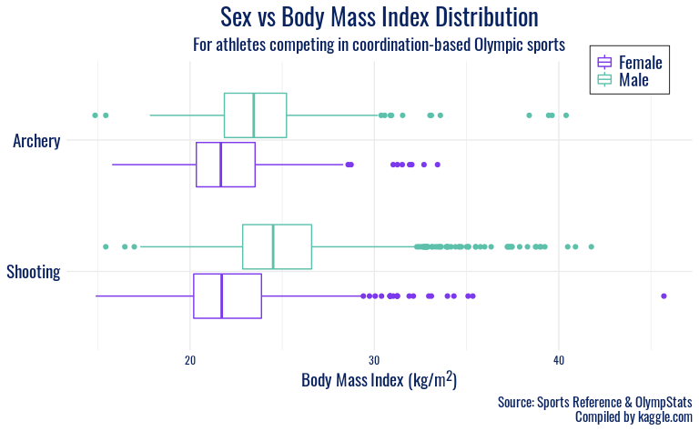
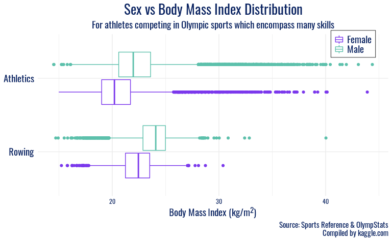
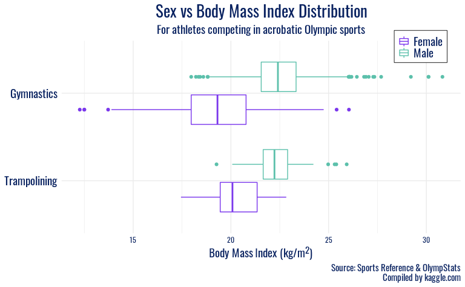

Project title
================
by Mr. Palmer’s Penguins

## Introduction

(1-2 paragraphs) Brief introduction to the dataset. You may repeat some
of the information about the dataset provided in the introduction to the
dataset on the TidyTuesday repository, paraphrasing on your own terms.
Imagine that your project is a standalone document and the grader has no
prior knowledge of the dataset.

## Does the optimal build of an Olympic athlete differ by sex or by sport? How have the trends in height and weight of Olympic athletes evolved over time?

### Introduction

(1-2 paragraphs) Introduction to the question and what parts of the
dataset are necessary to answer the question. Also discuss why you’re
interested in this question.

We are interested in exploring the physical characteristics of Olympic
athletes. The Olympic Games is unique in showcasing a variety of
disciplines and the body types of athletes who succeed at them. For
example, imagine a typical male Olympic wrestler, versus a typical
female gymnast. Pretty disparate builds, right? Even within one sport,
say gymnastics, we hypothesize that there may be different optimal
heights and weights for successful athletes of different genders
Therefore, to answer our first question, we will visualize the variables
`height`, `weight`, `age`, `sex`, `sport`, and `year`.

### Approach

(1-2 paragraphs) Describe what types of plots you are going to make to
address your question. For each plot, provide a clear explanation as to
why this plot (e.g. boxplot, barplot, histogram, etc.) is best for
providing the information you are asking about. The two plots should be
of different types, and at least one of the two plots needs to use
either color mapping or facets.

For our first plot, we plan to use boxplots to plot the distribution of
a size characteristic by `sex` (since characteristics tend to differ
among males and females) and faceting by `sport`. We are unsure which of
the `height`, `weight`, `height / weight`, or `bmi` ratio will be most
telling when examined across sexes and sports. We will start by making 4
plots (each with one of these on the y-axis) and then select the plot
where the trends are most insightful.

Two of these variables require new calculations in the data wrangling
step. In order to plot the height-weight-ratio, we will have to create
two new calculated columns. First, a `height_weight_ratio` column that
simply divides an athlete’s `height` by their `weight`, and a more
complicated `BMI` column that represents an existing
metric–[BMI](https://en.wikipedia.org/wiki/Body_mass_index)–that
integrates height and weight into a single measure. .

Based on the results from these preliminary plots, in addition to
narrowing in on a size characteristic, we might pick a few select sports
to focus in on (i.e. most popular sports) or group the sports based on
common characteristics (ex: contact vs. non-contact, etc.) since there
are 66 sports in the dataset.

### Analysis

``` r
# Create new calculated variables to represent physical build
olympics <- olympics %>%
  mutate(height_weight_ratio = height / weight,
         BMI = 10000 * weight / (height * height))

# load Olympic font
font_add_google(name = "Oswald")
showtext_auto()
```

After examining each of `height`, `weight`, `height_weight_ratio`, and
`BMI`, we have chosen to proceed with `BMI` as our size characteristic
for this plot, as the visualizations were the most accessible and
intuitive to interpret. After examining the plot displaying the `BMI`
for all sports, we are choosing a few select groups of sports to
include. The next step is to create separate dataframes for each of
these categories. We also want to represent each athlete once on the
plot, so we will have to use `distinct()`.

``` r
# create variable to represent category of sport
# keep only one observation per athlete
olympics <- olympics %>%
    distinct(id, .keep_all = TRUE) %>%
  mutate(sex = factor(sex, labels = c("Female", "Male"))) %>%
  filter(sport %in% c("Boxing", "Judo", "Weightlifting", "Wrestling", "Gymnastics", "Trampolining", "Archery", "Shooting", "Athletics", "Rowing")) %>%
  mutate(category = case_when(
                    sport %in% c("Boxing", "Judo", "Weightlifting", "Wrestling") ~ "weightclass",
                    sport %in% c("Gymnastics", "Trampolining") ~ "acrobatic",
                    sport %in% c("Archery", "Shooting") ~ "coordination",
                    TRUE ~ "diverse"),
        category = factor(category, levels = c("acrobatic", "diverse", "coordination", "weightclass")))

# create separate dataframes for each of these categories
olympics_weightclass <- olympics %>%
  filter(category == "weightclass")

olympics_coordination <- olympics %>%
  filter(category == "coordination")

olympics_diverse <- olympics %>%
  filter(category == "diverse")

olympics_acrobatic <- olympics %>%
  filter(category == "acrobatic")
```

We are now ready to create a separate plot for each sport category. We
will also silence messages which indicate that rows with NA have been
dropped from the dataframe when creating the boxplots.

``` r
ggplot(olympics_weightclass, mapping = aes(y = fct_rev(sport), x = BMI, color = sex)) +
  geom_boxplot(position = position_dodge2(10)) +
  labs(x = "Body Mass Index (kg/m^2)",
       y = NULL,
       color = "Sex",
       title = "Sex vs Body Mass Index Distribution",
       subtitle = "Of athletes competing in weightclass-based Olympic sports",,
       caption = "Source: Sports Reference & OlympStats\nCompiled by kaggle.com") +
  scale_color_manual(values = c("#7B38EC", "#5CC0AB")) +
  facet_grid(category ~ ., scales = "free_y", space = "free") +
  theme_minimal() +
  theme(strip.background = element_blank(),
        strip.text.y = element_blank(),
        panel.spacing.y = unit(0.4, "cm"),
        plot.title = element_text(family = "Oswald", color = "#092260", size = 20, hjust = 0.5),
        plot.caption = element_text(family = "Oswald", color = "#092260", size = 11),
        plot.subtitle = element_text(family = "Oswald", color = "#092260", size = 14, hjust = 0.5),
        axis.text.x = element_text(family = "Oswald", color = "#092260"),
        axis.title.x = element_text(family = "Oswald", color = "#092260", size = 14),
        axis.text.y = element_text(family = "Oswald", color = "#092260", size = 14),
        legend.text = element_text(family = "Oswald", color = "#092260", size = 14),
        legend.title = element_blank(),
        legend.position = c(0.9, 0.97),
        legend.background = element_rect(size = 0.3),
        legend.margin = margin(1, 5, 5, 5),
        legend.key.size = unit(0.5, "cm"))
```

    ## Warning: Removed 4166 rows containing non-finite values (stat_boxplot).


``` r
ggplot(olympics_coordination, mapping = aes(y = rev(sport), x = BMI, color = sex)) +
  geom_boxplot(position = position_dodge2(10)) +
  labs(x = "Body Mass Index (kg/m^2)",
       y = NULL,
       color = "Sex",
       title = "Sex vs Body Mass Index Distribution",
       subtitle = "Of athletes competing in coordination-based Olympic sports",,
       caption = "Source: Sports Reference & OlympStats\nCompiled by kaggle.com") +
  scale_color_manual(values = c("#7B38EC", "#5CC0AB")) +
  facet_grid(category ~ ., scales = "free_y", space = "free") +
  theme_minimal() +
  theme(strip.background = element_blank(),
        strip.text.y = element_blank(),
        panel.spacing.y = unit(0.4, "cm"),
        plot.title = element_text(family = "Oswald", color = "#092260", size = 20, hjust = 0.5),
        plot.caption = element_text(family = "Oswald", color = "#092260", size = 11),
        plot.subtitle = element_text(family = "Oswald", color = "#092260", size = 14, hjust = 0.5),
        axis.text.x = element_text(family = "Oswald", color = "#092260"),
        axis.title.x = element_text(family = "Oswald", color = "#092260", size = 14),
        axis.text.y = element_text(family = "Oswald", color = "#092260", size = 14),
        legend.text = element_text(family = "Oswald", color = "#092260", size = 14),
        legend.title = element_blank(),
        legend.position = c(0.9, 0.97),
        legend.background = element_rect(size = 0.3),
        legend.margin = margin(1, 5, 5, 5),
        legend.key.size = unit(0.5, "cm"))
```

    ## Warning: Removed 1874 rows containing non-finite values (stat_boxplot).



``` r
ggplot(olympics_diverse, mapping = aes(y = sport, x = BMI, color = sex)) +
  geom_boxplot(position = position_dodge2(10)) +
  labs(x = "Body Mass Index (kg/m^2)",
       y = NULL,
       color = "Sex",
       title = "Sex vs Body Mass Index Distribution",
       subtitle = "Of athletes competing in Olympic sports which encompass many skills",,
       caption = "Source: Sports Reference & OlympStats\nCompiled by kaggle.com") +
  scale_color_manual(values = c("#7B38EC", "#5CC0AB")) +
  facet_grid(category ~ ., scales = "free_y", space = "free") +
  theme_minimal() +
  theme(strip.background = element_blank(),
        strip.text.y = element_blank(),
        panel.spacing.y = unit(0.4, "cm"),
        plot.title = element_text(family = "Oswald", color = "#092260", size = 20, hjust = 0.5),
        plot.caption = element_text(family = "Oswald", color = "#092260", size = 11),
        plot.subtitle = element_text(family = "Oswald", color = "#092260", size = 14, hjust = 0.5),
        axis.text.x = element_text(family = "Oswald", color = "#092260"),
        axis.title.x = element_text(family = "Oswald", color = "#092260", size = 14),
        axis.text.y = element_text(family = "Oswald", color = "#092260", size = 14),
        legend.text = element_text(family = "Oswald", color = "#092260", size = 14),
        legend.title = element_blank(),
        legend.position = c(0.9, 0.9),
        legend.background = element_rect(size = 0.3),
        legend.margin = margin(1, 5, 5, 5),
        legend.key.size = unit(0.5, "cm"))
```

    ## Warning: Removed 6082 rows containing non-finite values (stat_boxplot).



``` r
ggplot(olympics_acrobatic, mapping = aes(y = sport, x = BMI, color = sex)) +
  geom_boxplot(position = position_dodge2(10)) +
  labs(x = "Body Mass Index (kg/m^2)",
       y = NULL,
       color = "Sex",
       title = "Sex vs Body Mass Index Distribution",
       subtitle = "Of athletes competing in acrobatic Olympic sports",,
       caption = "Source: Sports Reference & OlympStats\nCompiled by kaggle.com") +
  scale_color_manual(values = c("#7B38EC", "#5CC0AB")) +
  facet_grid(category ~ ., scales = "free_y", space = "free") +
  theme_minimal() +
  theme(strip.background = element_blank(),
        strip.text.y = element_blank(),
        panel.spacing.y = unit(0.4, "cm"),
        plot.title = element_text(family = "Oswald", color = "#092260", size = 20, hjust = 0.5),
        plot.caption = element_text(family = "Oswald", color = "#092260", size = 11),
        plot.subtitle = element_text(family = "Oswald", color = "#092260", size = 14, hjust = 0.5),
        axis.text.x = element_text(family = "Oswald", color = "#092260"),
        axis.title.x = element_text(family = "Oswald", color = "#092260", size = 14),
        axis.text.y = element_text(family = "Oswald", color = "#092260", size = 14),
        legend.text = element_text(family = "Oswald", color = "#092260", size = 14),
        legend.title = element_blank(),
        legend.position = c(0.9, 0.97),
        legend.background = element_rect(size = 0.3),
        legend.margin = margin(1, 5, 5, 5),
        legend.key.size = unit(0.5, "cm"))
```

    ## Warning: Removed 1944 rows containing non-finite values (stat_boxplot).



We found a citation for the Tokyo 2020 Olympics logo font
[here](https://www.reddit.com/r/identifythisfont/comments/4ig8ua/font_used_on_the_tokyo_2020_logo/)
and were pointed to an open-source alternative
[here](https://graphicdesign.stackexchange.com/questions/7178/is-there-a-din-font-free-alternative).
We got the hex code used in plot text manually from that logo source. We
chose the hex codes for our favorite gender color mapping from Telegraph
2018 [here](https://blog.datawrapper.de/gendercolor/).

We can now visualize these groups on the same plot, to get a better
sense of broader variability in size characteristics among an array of
Olympic sports.

``` r
ggplot(olympics, mapping = aes(y = sport, x = BMI, color = sex)) +
  geom_boxplot(position = position_dodge2(10)) +
  labs(x = "Body Mass Index (kg/m^2)",
       y = NULL,
       color = "Sex",
       title = "Sex vs Body Mass Index Distribution",
       subtitle = "Of athletes competing in selected Olympic sports from 1912-2020",,
       caption = "Source: Sports Reference & OlympStats\nCompiled by kaggle.com") +
  scale_color_manual(values = c("#7B38EC", "#5CC0AB")) +
  facet_grid(category ~ ., scales = "free_y", space = "free") +
  theme_minimal() +
  theme(strip.background = element_blank(),
        strip.text.y = element_blank(),
        panel.spacing.y = unit(0.4, "cm"),
        plot.title = element_text(family = "Oswald", color = "#092260", size = 20, hjust = 0.5),
        plot.caption = element_text(family = "Oswald", color = "#092260", size = 11),
        plot.subtitle = element_text(family = "Oswald", color = "#092260", size = 14, hjust = 0.5),
        axis.text.x = element_text(family = "Oswald", color = "#092260"),
        axis.title.x = element_text(family = "Oswald", color = "#092260", size = 14),
        axis.text.y = element_text(family = "Oswald", color = "#092260"),
        legend.text = element_text(family = "Oswald", color = "#092260", size = 14),
        legend.title = element_blank(),
        legend.position = c(0.9, 0.97),
        legend.background = element_rect(size = 0.3),
        legend.margin = margin(1, 5, 5, 5),
        legend.key.size = unit(0.5, "cm"))
```

    ## Warning: Removed 14066 rows containing non-finite values (stat_boxplot).


(2-3 code blocks, 2 figures, text/code comments as needed) In this
section, provide the code that generates your plots. Use scale functions
to provide nice axis labels and guides. You are welcome to use theme
functions to customize the appearance of your plot, but you are not
required to do so. All plots must be made with ggplot2. Do not use base
R or lattice plotting functions.

Plot 2 (Drew):

### Discussion

(1-3 paragraphs) In the Discussion section, interpret the results of
your analysis. Identify any trends revealed (or not revealed) by the
plots. Speculate about why the data looks the way it does.

In all plots, men typically have a higher-centered distribution of `BMI`
than women in the same sport, but other trends are more apparent by
`category`. In the first plot, which includes wrestling, weightlifting,
judo, and boxing, we see a strong right skew in most distributions. We
interpret this as a reflection of the weight classes present in those
sports, with many participants entering in lower weight classes, giving
a lower center, but a non-insignificant number of athletes with BMIs
higher than 30. However, there are fewer at these high BMIs, possibly
due to the difficulty in maintaining athletic competitiveness at that
proportion. Shooting and archery also have generally higher BMIs than
other sports, and again a right-skew is observed in the distributions.
This reflects those sports’ focus on hand-eye coordination, and thus
athlete body type or height or weight are more variable.

The next group of sports, Athletics and Rowing, feature distributions
with large variability on both sides. We interpret this as illustrating
the diversity of body types considered desirable in this sports: from
slender, lithe coxswains and sprinters to heavier, more powerful rowers
and throwers. Finally, the largest disparities between `sex` in a
particular sport are observed in Gymnastics and Trampoline. Here, we
speculate that the female gymnastics disciplines favor petite, nimble
athletes, as opposed to the more upper-body strength oriented male
apparatuses, which contribute to a higher average BMI for male Olympic
gymnasts.

## Question 2 \<- Update title to relate to the question you’re answering

### Introduction

(1-2 paragraphs) Introduction to the question and what parts of the
dataset are necessary to answer the question. Also discuss why you’re
interested in this question.

### Approach

(1-2 paragraphs) Describe what types of plots you are going to make to
address your question. For each plot, provide a clear explanation as to
why this plot (e.g. boxplot, barplot, histogram, etc.) is best for
providing the information you are asking about. The two plots should be
of different types, and at least one of the two plots needs to use
either color mapping or facets.

### Analysis

(2-3 code blocks, 2 figures, text/code comments as needed) In this
section, provide the code that generates your plots. Use scale functions
to provide nice axis labels and guides. You are welcome to use theme
functions to customize the appearance of your plot, but you are not
required to do so. All plots must be made with ggplot2. Do not use base
R or lattice plotting functions.

### Discussion

(1-3 paragraphs) In the Discussion section, interpret the results of
your analysis. Identify any trends revealed (or not revealed) by the
plots. Speculate about why the data looks the way it does.

## Presentation

Our presentation can be found [here](presentation/presentation.html).

## Data

Include a citation for your data here. See
<http://libraryguides.vu.edu.au/c.php?g=386501&p=4347840> for guidance
on proper citation for datasets. If you got your data off the web, make
sure to note the retrieval date.

## References

List any references here. You should, at a minimum, list your data
source.
