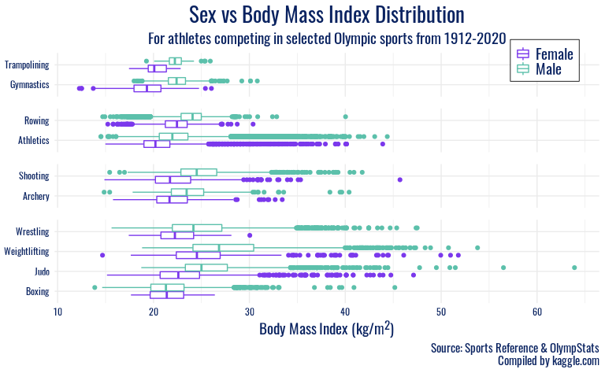
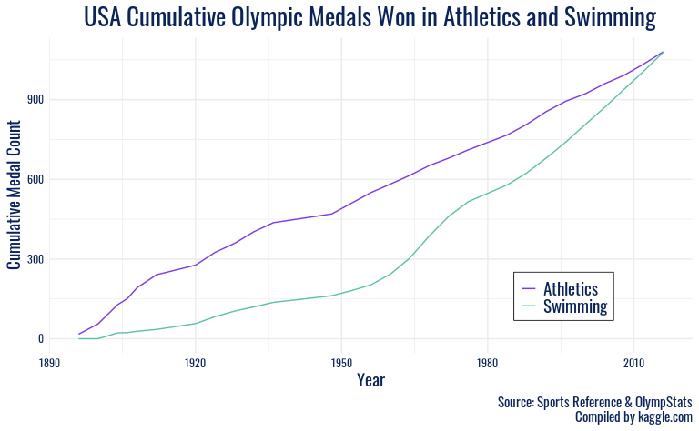

Project title
================
by Mr. Palmer’s Penguins

    ## 
    ## Attaching package: 'lubridate'

    ## The following objects are masked from 'package:base':
    ## 
    ##     date, intersect, setdiff, union

    ## Loading required package: ggplot2

    ## Rows: 271116 Columns: 15

    ## ── Column specification ────────────────────────────────────────────────────────
    ## Delimiter: ","
    ## chr (10): name, sex, team, noc, games, season, city, sport, event, medal
    ## dbl  (5): id, age, height, weight, year

    ## 
    ## ℹ Use `spec()` to retrieve the full column specification for this data.
    ## ℹ Specify the column types or set `show_col_types = FALSE` to quiet this message.

## Introduction

The set, which includes 15 variables and 271116 observations, provides
insight into the athletes that competed in and the results of the
Olympic games from Athens 1896 to Rio 2016. Each observation includes
information about an athlete on a per event basis. Therefore, if an
athlete competes in multiple different events, there will be multiple
different observations reflecting each event an individual participated
in. Each observation details medal results (Gold, Silver, Bronze, or
NA), the athlete’s background (age, sex, height, weight, team they’re
competing for, etc.), and context about the event (where and when it was
held, season, sport the athlete competes in, etc.).

We chose this dataset because we think it can provide a lot of good
insights into some of the trends at the Olympics over the past century
as well as provide strong opportunities for our group to develop our
visualization capabilities.

This dataset was accessed on
[kaggle.com](https://www.kaggle.com/heesoo37/120-years-of-olympic-history-athletes-and-results)
and includes data scraped in May 2018 from Sports Reference/OlympStats,
sports statistics sites, by Randi Griffin, a Senior Data Scientist at
Boston Consulting Group. Moreover, it was selected as part of the
[TidyTuesday](https://github.com/rfordatascience/tidytuesday/tree/master/data/2021#readme7c70d95441aec295a1e92da9d71e2872877d663c)
challenge on 7/27/21.

## Do certain physical characteristics (such as body mass index, age, and sex) of Olympic participants differ by sport and/or change with time?

Does the optimal build of an Olympic athlete differ by sex or by sport?
How have the ages of these Olympic athletes evolved over time?

### Introduction

(1-2 paragraphs) Introduction to the question and what parts of the
dataset are necessary to answer the question. Also discuss why you’re
interested in this question.

We are interested in exploring the physical characteristics of Olympic
athletes. The Olympic Games is unique in showcasing a variety of
disciplines and the body types of athletes who succeed at them. For
example, imagine a typical male Olympic wrestler, versus a typical
female gymnast. Pretty disparate builds, right? Even within one sport,
say gymnastics, we hypothesize that there may be different optimal
heights and weights for successful athletes of different genders
Therefore, to answer our first question, we will visualize the variables
`height`, `weight`, `age`, `sex`, `sport`, and `year`.

### Approach

(1-2 paragraphs) Describe what types of plots you are going to make to
address your question. For each plot, provide a clear explanation as to
why this plot (e.g. boxplot, barplot, histogram, etc.) is best for
providing the information you are asking about. The two plots should be
of different types, and at least one of the two plots needs to use
either color mapping or facets.

For our first plot, we plan to use boxplots to plot the distribution of
a size characteristic by `sex` (since characteristics tend to differ
among males and females) and faceting by `sport`. We are unsure which of
the `height`, `weight`, `height / weight`, or `bmi` ratio will be most
telling when examined across sexes and sports. We will start by making 4
plots (each with one of these on the y-axis) and then select the plot
where the trends are most insightful.

Two of these variables require new calculations in the data wrangling
step. In order to plot the height-weight-ratio, we will have to create
two new calculated columns. First, a `height_weight_ratio` column that
simply divides an athlete’s `height` by their `weight`, and a more
complicated `BMI` column that represents an existing
metric–[BMI](https://en.wikipedia.org/wiki/Body_mass_index)–that
integrates height and weight into a single measure. .

Based on the results from these preliminary plots, in addition to
narrowing in on a size characteristic, we might pick a few select sports
to focus in on (i.e. most popular sports) or group the sports based on
common characteristics (ex: contact vs. non-contact, etc.) since there
are 66 sports in the dataset.

### Analysis

``` r
# Create new calculated variables to represent physical build
olympics <- olympics %>%
  mutate(height_weight_ratio = height / weight,
         BMI = 10000 * weight / (height * height))

# load Olympic font
font_add_google(name = "Oswald")
showtext_auto()
```

After examining each of `height`, `weight`, `height_weight_ratio`, and
`BMI`, we have chosen to proceed with `BMI` as our size characteristic
for this plot, as the visualizations were the most accessible and
intuitive to interpret. After examining the plot displaying the `BMI`
for all sports, we are choosing a few select groups of sports to
include. The next step is to create separate dataframes for each of
these categories. We also want to represent each athlete once on the
plot, so we will have to use `distinct()`.

``` r
# create variable to represent category of sport
# keep only one observation per athlete
olympics <- olympics %>%
    distinct(id, .keep_all = TRUE) %>%
  mutate(sex = factor(sex, labels = c("Female", "Male"))) %>%
  filter(sport %in% c("Boxing", "Judo", "Weightlifting", "Wrestling", "Gymnastics", "Trampolining", "Archery", "Shooting", "Athletics", "Rowing")) %>%
  mutate(category = case_when(
                    sport %in% c("Boxing", "Judo", "Weightlifting", "Wrestling") ~ "weightclass",
                    sport %in% c("Gymnastics", "Trampolining") ~ "acrobatic",
                    sport %in% c("Archery", "Shooting") ~ "coordination",
                    TRUE ~ "diverse"),
        category = factor(category, levels = c("acrobatic", "diverse", "coordination", "weightclass")))

# create separate dataframes for each of these categories
olympics_weightclass <- olympics %>%
  filter(category == "weightclass")

olympics_coordination <- olympics %>%
  filter(category == "coordination")

olympics_diverse <- olympics %>%
  filter(category == "diverse")

olympics_acrobatic <- olympics %>%
  filter(category == "acrobatic")
```

We are now ready to create a separate plot for each sport category. We
will also silence messages which indicate that rows with NA have been
dropped from the dataframe when creating the boxplots.

``` r
ggplot(olympics_weightclass, mapping = aes(y = fct_rev(sport), x = BMI, color = sex)) +
  geom_boxplot(position = position_dodge2(10)) +
  labs(x = "Body Mass Index (kg/m<sup>2</sup>)",
       y = NULL,
       color = "Sex",
       title = "Sex vs Body Mass Index Distribution",
       subtitle = "For athletes competing in weightclass-based Olympic sports",,
       caption = "Source: Sports Reference & OlympStats\nCompiled by kaggle.com") +
  scale_color_manual(values = c("#7B38EC", "#5CC0AB")) +
  facet_grid(category ~ ., scales = "free_y", space = "free") +
  theme_minimal() +
  theme(strip.background = element_blank(),
        strip.text.y = element_blank(),
        panel.spacing.y = unit(0.4, "cm"),
        plot.title = element_text(family = "Oswald", color = "#092260", size = 20, hjust = 0.5),
        plot.caption = element_text(family = "Oswald", color = "#092260", size = 11),
        plot.subtitle = element_text(family = "Oswald", color = "#092260", size = 14, hjust = 0.5),
        axis.text.x = element_text(family = "Oswald", color = "#092260"),
        axis.title.x = element_markdown(family = "Oswald", color = "#092260", size = 14),
        axis.text.y = element_text(family = "Oswald", color = "#092260", size = 14),
        legend.text = element_text(family = "Oswald", color = "#092260", size = 14),
        legend.title = element_blank(),
        legend.position = c(0.9, 0.97),
        legend.background = element_rect(size = 0.3),
        legend.margin = margin(1, 5, 5, 5),
        legend.key.size = unit(0.5, "cm"))
```


``` r
ggplot(olympics_coordination, mapping = aes(y = rev(sport), x = BMI, color = sex)) +
  geom_boxplot(position = position_dodge2(10)) +
  labs(x = "Body Mass Index (kg/m<sup>2</sup>)",
       y = NULL,
       color = "Sex",
       title = "Sex vs Body Mass Index Distribution",
       subtitle = "For athletes competing in coordination-based Olympic sports",,
       caption = "Source: Sports Reference & OlympStats\nCompiled by kaggle.com") +
  scale_color_manual(values = c("#7B38EC", "#5CC0AB")) +
  facet_grid(category ~ ., scales = "free_y", space = "free") +
  theme_minimal() +
  theme(strip.background = element_blank(),
        strip.text.y = element_blank(),
        panel.spacing.y = unit(0.4, "cm"),
        plot.title = element_text(family = "Oswald", color = "#092260", size = 20, hjust = 0.5),
        plot.caption = element_text(family = "Oswald", color = "#092260", size = 11),
        plot.subtitle = element_text(family = "Oswald", color = "#092260", size = 14, hjust = 0.5),
        axis.text.x = element_text(family = "Oswald", color = "#092260"),
        axis.title.x = element_markdown(family = "Oswald", color = "#092260", size = 14),
        axis.text.y = element_text(family = "Oswald", color = "#092260", size = 14),
        legend.text = element_text(family = "Oswald", color = "#092260", size = 14),
        legend.title = element_blank(),
        legend.position = c(0.9, 0.97),
        legend.background = element_rect(size = 0.3),
        legend.margin = margin(1, 5, 5, 5),
        legend.key.size = unit(0.5, "cm"))
```


``` r
ggplot(olympics_diverse, mapping = aes(y = sport, x = BMI, color = sex)) +
  geom_boxplot(position = position_dodge2(10)) +
  labs(x = "Body Mass Index (kg/m<sup>2</sup>)",
       y = NULL,
       color = "Sex",
       title = "Sex vs Body Mass Index Distribution",
       subtitle = "For athletes competing in Olympic sports which encompass many skills",,
       caption = "Source: Sports Reference & OlympStats\nCompiled by kaggle.com") +
  scale_color_manual(values = c("#7B38EC", "#5CC0AB")) +
  facet_grid(category ~ ., scales = "free_y", space = "free") +
  theme_minimal() +
  theme(strip.background = element_blank(),
        strip.text.y = element_blank(),
        panel.spacing.y = unit(0.4, "cm"),
        plot.title = element_text(family = "Oswald", color = "#092260", size = 20, hjust = 0.5),
        plot.caption = element_text(family = "Oswald", color = "#092260", size = 11),
        plot.subtitle = element_text(family = "Oswald", color = "#092260", size = 14, hjust = 0.5),
        axis.text.x = element_text(family = "Oswald", color = "#092260"),
        axis.title.x = element_markdown(family = "Oswald", color = "#092260", size = 14),
        axis.text.y = element_text(family = "Oswald", color = "#092260", size = 14),
        legend.text = element_text(family = "Oswald", color = "#092260", size = 14),
        legend.title = element_blank(),
        legend.position = c(0.9, 0.9),
        legend.background = element_rect(size = 0.3),
        legend.margin = margin(1, 5, 5, 5),
        legend.key.size = unit(0.5, "cm"))
```


``` r
ggplot(olympics_acrobatic, mapping = aes(y = sport, x = BMI, color = sex)) +
  geom_boxplot(position = position_dodge2(10)) +
  labs(x = "Body Mass Index (kg/m<sup>2</sup>)",
       y = NULL,
       color = "Sex",
       title = "Sex vs Body Mass Index Distribution",
       subtitle = "For athletes competing in acrobatic Olympic sports",,
       caption = "Source: Sports Reference & OlympStats\nCompiled by kaggle.com") +
  scale_color_manual(values = c("#7B38EC", "#5CC0AB")) +
  facet_grid(category ~ ., scales = "free_y", space = "free") +
  theme_minimal() +
  theme(strip.background = element_blank(),
        strip.text.y = element_blank(),
        panel.spacing.y = unit(0.4, "cm"),
        plot.title = element_text(family = "Oswald", color = "#092260", size = 20, hjust = 0.5),
        plot.caption = element_text(family = "Oswald", color = "#092260", size = 11),
        plot.subtitle = element_text(family = "Oswald", color = "#092260", size = 14, hjust = 0.5),
        axis.text.x = element_text(family = "Oswald", color = "#092260"),
        axis.title.x = element_markdown(family = "Oswald", color = "#092260", size = 14),
        axis.text.y = element_text(family = "Oswald", color = "#092260", size = 14),
        legend.text = element_text(family = "Oswald", color = "#092260", size = 14),
        legend.title = element_blank(),
        legend.position = c(0.9, 0.97),
        legend.background = element_rect(size = 0.3),
        legend.margin = margin(1, 5, 5, 5),
        legend.key.size = unit(0.5, "cm"))
```


We found a citation for the Tokyo 2020 Olympics logo font
[here](https://www.reddit.com/r/identifythisfont/comments/4ig8ua/font_used_on_the_tokyo_2020_logo/)
and were pointed to an open-source alternative
[here](https://graphicdesign.stackexchange.com/questions/7178/is-there-a-din-font-free-alternative).
We got the hex code used in plot text manually from that logo source. We
chose the hex codes for our favorite gender color mapping from Telegraph
2018 [here](https://blog.datawrapper.de/gendercolor/).

We can now visualize these groups on the same plot, to get a better
sense of broader variability in size characteristics among an array of
Olympic sports.

``` r
ggplot(olympics, mapping = aes(y = sport, x = BMI, color = sex)) +
  geom_boxplot(position = position_dodge2(10)) +
  labs(x = "Body Mass Index (kg/m<sup>2</sup>)",
       y = NULL,
       color = "Sex",
       title = "Sex vs Body Mass Index Distribution",
       subtitle = "For athletes competing in selected Olympic sports from 1912-2020",,
       caption = "Source: Sports Reference & OlympStats\nCompiled by kaggle.com") +
  scale_color_manual(values = c("#7B38EC", "#5CC0AB")) +
  facet_grid(category ~ ., scales = "free_y", space = "free") +
  theme_minimal() +
  theme(strip.background = element_blank(),
        strip.text.y = element_blank(),
        panel.spacing.y = unit(0.4, "cm"),
        plot.title = element_text(family = "Oswald", color = "#092260", size = 20, hjust = 0.5),
        plot.caption = element_text(family = "Oswald", color = "#092260", size = 11),
        plot.subtitle = element_text(family = "Oswald", color = "#092260", size = 14, hjust = 0.5),
        axis.text.x = element_text(family = "Oswald", color = "#092260"),
        axis.title.x = element_markdown(family = "Oswald", color = "#092260", size = 14),
        axis.text.y = element_text(family = "Oswald", color = "#092260"),
        legend.text = element_text(family = "Oswald", color = "#092260", size = 14),
        legend.title = element_blank(),
        legend.position = c(0.9, 0.97),
        legend.background = element_rect(size = 0.3),
        legend.margin = margin(1, 5, 5, 5),
        legend.key.size = unit(0.5, "cm"))
```



(2-3 code blocks, 2 figures, text/code comments as needed) In this
section, provide the code that generates your plots. Use scale functions
to provide nice axis labels and guides. You are welcome to use theme
functions to customize the appearance of your plot, but you are not
required to do so. All plots must be made with ggplot2. Do not use base
R or lattice plotting functions.

Plot 2 (Drew):

``` r
# Create new calculated variables to represent physical build
olympics <- olympics %>%
  mutate(height_weight_ratio = height / weight,
         BMI = 10000 * weight / (height * height))
```

``` r
# keep only one observation per athlete
olympics <- olympics %>%
    distinct(id, year, .keep_all = TRUE) %>%
  mutate(sex = factor(sex, labels = c("Female", "Male")))
```

``` r
olympics %>%
  drop_na(age) %>%
  group_by(year, sex) %>%
  summarise(avg_age = mean(age)) %>%
  arrange(desc(sex)) %>%
  ggplot(mapping = aes(y = avg_age, x = year)) +
  geom_point(aes(color = sex)) +
  labs(x = "Year",
       y = "Age",
       color = "Sex",
       title = "Average Yearly Age of Athletes By Sex",
       subtitle = "For athletes competing in selected Olympic sports from 1912-2020",
       caption = "Source: Sports Reference & OlympStats\nCompiled by kaggle.com") +
  scale_color_manual(values = c("#7B38EC", "#5CC0AB")) +
  theme_minimal() +
  theme(strip.background = element_blank(),
        strip.text.y = element_blank(),
        panel.spacing.y = unit(0.4, "cm"),
        plot.title = element_text(family = "Oswald", color = "#092260", size = 20, hjust = 0.5),
        plot.caption = element_text(family = "Oswald", color = "#092260", size = 11),
        plot.subtitle = element_text(family = "Oswald", color = "#092260", size = 14, hjust = 0.5),
        axis.text.x = element_text(family = "Oswald", color = "#092260"),
        axis.title.x = element_text(family = "Oswald", color = "#092260", size = 14),
        axis.title.y = element_text(family = "Oswald", color = "#092260", size = 14),
        axis.text.y = element_text(family = "Oswald", color = "#092260"),
        legend.text = element_text(family = "Oswald", color = "#092260", size = 14),
        legend.title = element_blank(),
        legend.position = c(0.8, 0.68),
        legend.background = element_rect(size = 0.3),
        legend.margin = margin(1, 5, 5, 5),
        legend.key.size = unit(0.5, "cm"))
```

    ## `summarise()` has grouped output by 'year'. You can override using the `.groups` argument.

 Tried
median to see if it gets rid of outlier but does not

For our second plot, we will look more closely at how size
characteristics have changed over time, using `year` to make a time
series line plots for these different values. In other words, we will
plot one of the size characteristics (`height`, `weight`, or the
height:weight ratio) on the y-axis vs. time on the x-axis. Lines by
`sex` will connect the observations. We might also facet these plots by
`age` to see if, for example, height of athletes has changed more or
less over time for younger athletes vs. older athletes. In order to
facet by `age`, we will have to make `age` a categorical variable by
setting different cutoffs in which we group observations.

The ages in the dataset range from 10 to 97 years old. Therefore, we
will plot a histogram and do summary statistics to understand which
cutoffs make the most sense given the data. Since athletes tend to be in
their mid 20s, we’ll likely have smaller differences in ages in the
20-30 age range whereas all athletes 40-97, for example, might be
grouped together. However, as mentioned, this would depend on the
distribution of the data.

Like in Plot 1, we will evaluate which of `height`, `weight`, or the
`height:weight` ratio provides the most insightful visualization.
Ideally, the variable we choose in Plot 1 will be the same as in Plot 2;
however, we understand creating visualizations is an iterative process
are open to evaluating all options as we plot.

For our second plot, we will look more closely at how size
characteristics have changed over time, using `year` to make a time
series line plots for these different values. In other words, we will
plot one of the size characteristics (`height`, `weight`, or the
height:weight ratio) on the y-axis vs. time on the x-axis. Lines by
`sex` will connect the observations. We might also facet these plots by
`age` to see if, for example, height of athletes has changed more or
less over time for younger athletes vs. older athletes. In order to
facet by `age`, we will have to make `age` a categorical variable by
setting different cutoffs in which we group observations.

The ages in the dataset range from 10 to 97 years old. Therefore, we
will plot a histogram and do summary statistics to understand which
cutoffs make the most sense given the data. Since athletes tend to be in
their mid 20s, we’ll likely have smaller differences in ages in the
20-30 age range whereas all athletes 40-97, for example, might be
grouped together. However, as mentioned, this would depend on the
distribution of the data.

Like in Plot 1, we will evaluate which of `height`, `weight`, or the
`height:weight` ratio provides the most insightful visualization.
Ideally, the variable we choose in Plot 1 will be the same as in Plot 2;
however, we understand creating visualizations is an iterative process
are open to evaluating all options as we plot.

### Discussion

(1-3 paragraphs) In the Discussion section, interpret the results of
your analysis. Identify any trends revealed (or not revealed) by the
plots. Speculate about why the data looks the way it does.

In all plots, men typically have a higher-centered distribution of `BMI`
than women in the same sport, but other trends are more apparent by
`category`. In the first plot, which includes wrestling, weightlifting,
judo, and boxing, we see a strong right skew in most distributions. We
interpret this as a reflection of the weight classes present in those
sports, with many participants entering in lower weight classes, giving
a lower center, but a non-insignificant number of athletes with BMIs
higher than 30. However, there are fewer at these high BMIs, possibly
due to the difficulty in maintaining athletic competitiveness at that
proportion. Shooting and archery also have generally higher BMIs than
other sports, and again a right-skew is observed in the distributions.
This reflects those sports’ focus on hand-eye coordination, and thus
athlete body type or height or weight are more variable.

The next group of sports, Athletics and Rowing, feature distributions
with large variability on both sides. We interpret this as illustrating
the diversity of body types considered desirable in this sports: from
slender, lithe coxswains and sprinters to heavier, more powerful rowers
and throwers. Finally, the largest disparities between `sex` in a
particular sport are observed in Gymnastics and Trampoline. Here, we
speculate that the female gymnastics disciplines favor petite, nimble
athletes, as opposed to the more upper-body strength oriented male
apparatuses, which contribute to a higher average BMI for male Olympic
gymnasts.

## Question 2 \<- Update title to relate to the question you’re answering

### Introduction

(1-2 paragraphs) Introduction to the question and what parts of the
dataset are necessary to answer the question. Also discuss why you’re
interested in this question.

### Approach

(1-2 paragraphs) Describe what types of plots you are going to make to
address your question. For each plot, provide a clear explanation as to
why this plot (e.g. boxplot, barplot, histogram, etc.) is best for
providing the information you are asking about. The two plots should be
of different types, and at least one of the two plots needs to use
either color mapping or facets.

### Analysis

(2-3 code blocks, 2 figures, text/code comments as needed) In this
section, provide the code that generates your plots. Use scale functions
to provide nice axis labels and guides. You are welcome to use theme
functions to customize the appearance of your plot, but you are not
required to do so. All plots must be made with ggplot2. Do not use base
R or lattice plotting functions. \#\#\#\# Plot 1

``` r
olympics <- read_csv(file = paste0(here::here(), "/data/olympics_data.csv"))
```

    ## Rows: 271116 Columns: 15

    ## ── Column specification ────────────────────────────────────────────────────────
    ## Delimiter: ","
    ## chr (10): name, sex, team, noc, games, season, city, sport, event, medal
    ## dbl  (5): id, age, height, weight, year

    ## 
    ## ℹ Use `spec()` to retrieve the full column specification for this data.
    ## ℹ Specify the column types or set `show_col_types = FALSE` to quiet this message.

``` r
noc_regions <- read_csv(file = paste0(here::here(), "/data/noc_regions.csv"))
```

    ## Rows: 230 Columns: 3

    ## ── Column specification ────────────────────────────────────────────────────────
    ## Delimiter: ","
    ## chr (3): NOC, region, notes

    ## 
    ## ℹ Use `spec()` to retrieve the full column specification for this data.
    ## ℹ Specify the column types or set `show_col_types = FALSE` to quiet this message.

``` r
# make appropriate date
olympics %<>%
  mutate(date = ifelse(season == "Winter", paste0(year, "-02-01"), paste0(year, "-07-01")),
         date = ymd(date),
         medal_winner = ifelse(is.na(medal), 0, 1),
         medal_score = case_when(
           medal == "Bronze" ~ 1,
           medal == "Silver" ~ 2,
           medal == "Gold" ~ 3,
           TRUE ~ 0))

noc_regions %<>%
  janitor::clean_names() %>%
  mutate(region = ifelse(region == "Boliva", "Bolivia", region))

flags <- tibble(noc = noc_regions$noc, region = noc_regions$region, flag = countrycode(noc_regions$region, 'country.name', 'unicode.symbol'))
```

    ## Warning in countrycode_convert(sourcevar = sourcevar, origin = origin, destination = dest, : Some values were not matched unambiguously: Individual Olympic Athletes, Micronesia

``` r
olympics <- left_join(olympics, flags, by = "noc")

olympics
```

    ## # A tibble: 271,116 × 20
    ##       id name    sex     age height weight team   noc   games  year season city 
    ##    <dbl> <chr>   <chr> <dbl>  <dbl>  <dbl> <chr>  <chr> <chr> <dbl> <chr>  <chr>
    ##  1     1 A Diji… M        24    180     80 China  CHN   1992…  1992 Summer Barc…
    ##  2     2 A Lamu… M        23    170     60 China  CHN   2012…  2012 Summer Lond…
    ##  3     3 Gunnar… M        24     NA     NA Denma… DEN   1920…  1920 Summer Antw…
    ##  4     4 Edgar … M        34     NA     NA Denma… DEN   1900…  1900 Summer Paris
    ##  5     5 Christ… F        21    185     82 Nethe… NED   1988…  1988 Winter Calg…
    ##  6     5 Christ… F        21    185     82 Nethe… NED   1988…  1988 Winter Calg…
    ##  7     5 Christ… F        25    185     82 Nethe… NED   1992…  1992 Winter Albe…
    ##  8     5 Christ… F        25    185     82 Nethe… NED   1992…  1992 Winter Albe…
    ##  9     5 Christ… F        27    185     82 Nethe… NED   1994…  1994 Winter Lill…
    ## 10     5 Christ… F        27    185     82 Nethe… NED   1994…  1994 Winter Lill…
    ## # … with 271,106 more rows, and 8 more variables: sport <chr>, event <chr>,
    ## #   medal <chr>, date <date>, medal_winner <dbl>, medal_score <dbl>,
    ## #   region <chr>, flag <chr>

``` r
olympics_filter <- olympics %>%
  filter(season == "Summer") %>%
  group_by(noc) %>%
  summarize(total_winners = sum(medal_winner), total_score = sum(medal_score))%>%
  filter(total_winners >= 910)
```

``` r
olympics_filter
```

    ## # A tibble: 10 × 3
    ##    noc   total_winners total_score
    ##    <chr>         <dbl>       <dbl>
    ##  1 AUS            1304        2440
    ##  2 FRA            1627        3132
    ##  3 GBR            1985        3986
    ##  4 GER            1779        3501
    ##  5 HUN            1123        2315
    ##  6 ITA            1446        2956
    ##  7 NED             918        1710
    ##  8 SWE            1108        2212
    ##  9 URS            2063        4362
    ## 10 USA            5002       11279

``` r
ggplot(olympics_filter, aes(x = reorder(noc, total_winners), y = total_winners, fill = noc, color = noc))+
  geom_bar(stat='identity')+
  labs(x = "Country",
       y = "Medal Count",
       title = "All-time Summer Olympic Medal Counts",
       subtitle = "For the top 10 most winningest countries in history",
       caption = "Source: Sports Reference & OlympStats\nCompiled by kaggle.com") +
  theme_minimal() +
  scale_color_manual(values = c("#5CC0AB","#5CC0AB","#5CC0AB","#5CC0AB","#5CC0AB","#5CC0AB","#5CC0AB","#5CC0AB","#5CC0AB","#5CC0AB")) +
  scale_fill_manual(values = c("#5CC0AB","#5CC0AB","#5CC0AB","#5CC0AB","#5CC0AB","#5CC0AB","#5CC0AB","#5CC0AB","#5CC0AB","#5CC0AB")) +
  theme(strip.background = element_blank(),
        strip.text.y = element_blank(),
        panel.spacing.y = unit(0.4, "cm"),
        plot.title = element_text(family = "Oswald", color = "#092260", size = 20, hjust = 0.5),
        plot.caption = element_text(family = "Oswald", color = "#092260", size = 11),
        plot.subtitle = element_text(family = "Oswald", color = "#092260", size = 14, hjust = 0.5),
        axis.text.x = element_text(family = "Oswald", color = "#092260"),
        axis.title.x = element_markdown(family = "Oswald", color = "#092260", size = 14),
        axis.text.y = element_text(family = "Oswald", color = "#092260"),
        axis.title.y = element_markdown(family = "Oswald", color = "#092260", size = 14),
        legend.position = "none")
```


``` r
usa_fil <- olympics %>%
  filter(noc == "USA") %>%
  group_by(sport, year)%>%
  summarize(total_winners = sum(medal_winner), total_score = sum(medal_score))%>%
  filter(sport %in% c("Swimming", "Athletics"))
```

    ## `summarise()` has grouped output by 'sport'. You can override using the `.groups` argument.

``` r
usa_fil
```

    ## # A tibble: 56 × 4
    ## # Groups:   sport [2]
    ##    sport      year total_winners total_score
    ##    <chr>     <dbl>         <dbl>       <dbl>
    ##  1 Athletics  1896            17          41
    ##  2 Athletics  1900            39          84
    ##  3 Athletics  1904            72         149
    ##  4 Athletics  1906            23          51
    ##  5 Athletics  1908            41          93
    ##  6 Athletics  1912            49         109
    ##  7 Athletics  1920            36          80
    ##  8 Athletics  1924            48          99
    ##  9 Athletics  1928            34          75
    ## 10 Athletics  1932            44         107
    ## # … with 46 more rows

``` r
ggplot(usa_fil, aes(x = year, y = total_winners, color = sport, group = sport))+
  geom_line()+
  geom_point()+
  labs(x = "Year",
       y = "Medal Count",
       title = "USA Medals Won in Athletics and Swimming",
       caption = "Source: Sports Reference & OlympStats\nCompiled by kaggle.com") +
  theme_minimal() +
  scale_color_manual(values = c("#7B38EC","#5CC0AB"))+
  theme(strip.background = element_blank(),
        strip.text.y = element_blank(),
        panel.spacing.y = unit(0.4, "cm"),
        plot.title = element_text(family = "Oswald", color = "#092260", size = 20, hjust = 0.5),
        plot.caption = element_text(family = "Oswald", color = "#092260", size = 11),
        plot.subtitle = element_text(family = "Oswald", color = "#092260", size = 14, hjust = 0.5),
        axis.text.x = element_text(family = "Oswald", color = "#092260"),
        axis.title.x = element_markdown(family = "Oswald", color = "#092260", size = 14),
        axis.text.y = element_text(family = "Oswald", color = "#092260"),
        axis.title.y = element_markdown(family = "Oswald", color = "#092260", size = 14),
        legend.text = element_text(family = "Oswald", color = "#092260", size = 14),
        legend.title = element_blank(),
        legend.position = c(0.8, 0.18),
        legend.background = element_rect(size = 0.3),
        legend.margin = margin(1, 5, 5, 5),
        legend.key.size = unit(0.5, "cm"))
```


``` r
ggplot(usa_fil, aes(x = year, y = cumsum(total_winners), color = sport, group = sport))+
  geom_line()+
  labs(x = "Year",
       y = "Medal Count",
       title = "USA Medals Won in Athletics and Swimming",
       caption = "Source: Sports Reference & OlympStats\nCompiled by kaggle.com") +
  theme_minimal() +
  scale_color_manual(values = c("#7B38EC","#5CC0AB"))+
  theme(strip.background = element_blank(),
        strip.text.y = element_blank(),
        panel.spacing.y = unit(0.4, "cm"),
        plot.title = element_text(family = "Oswald", color = "#092260", size = 20, hjust = 0.5),
        plot.caption = element_text(family = "Oswald", color = "#092260", size = 11),
        plot.subtitle = element_text(family = "Oswald", color = "#092260", size = 14, hjust = 0.5),
        axis.text.x = element_text(family = "Oswald", color = "#092260"),
        axis.title.x = element_markdown(family = "Oswald", color = "#092260", size = 14),
        axis.text.y = element_text(family = "Oswald", color = "#092260"),
        axis.title.y = element_markdown(family = "Oswald", color = "#092260", size = 14),
        legend.text = element_text(family = "Oswald", color = "#092260", size = 14),
        legend.title = element_blank(),
        legend.position = c(0.8, 0.18),
        legend.background = element_rect(size = 0.3),
        legend.margin = margin(1, 5, 5, 5),
        legend.key.size = unit(0.5, "cm"))
```



In our first visualization, we will plot `medals_total` on the y-axis
and `date` on the x-axis with lines grouped by `country` and faceting by
`sport`. We will select just a few sports of interest to compare and use
selective color mapping for countries of interest and transparency to
strongly highlight a few countries and make the remaining lines
indistinguishable in the background. If this technique remains visually
overwhelming after prototyping our plot, we will filter to select just a
few countries of interest in each sport and color map only those.

#### Plot 2

``` r
gdp <- read_csv("data/gdp-per-capita-maddison-2020.csv")
```

    ## Warning: One or more parsing issues, see `problems()` for details

    ## Rows: 19878 Columns: 5

    ## ── Column specification ────────────────────────────────────────────────────────
    ## Delimiter: ","
    ## chr (2): Entity, Code
    ## dbl (2): Year, GDP per capita
    ## lgl (1): 145446-annotations

    ## 
    ## ℹ Use `spec()` to retrieve the full column specification for this data.
    ## ℹ Specify the column types or set `show_col_types = FALSE` to quiet this message.

``` r
gdp %<>%
  janitor::clean_names()
```

``` r
olympics_gdp <- olympics %>%
  group_by(region, date) %>%
  summarize(total_winners = sum(medal_winner), total_score = sum(medal_score), .groups = "drop") %>%
  rename(entity = region) %>%
  mutate(year = year(date)) %>%
  left_join(gdp, by = c("entity", "year"))
```

``` r
olympics_gdp %>%
  filter(year >= 2010) %>%
  ggplot(aes(x = gdp_per_capita, total_score)) +
  geom_point() +
  facet_wrap(~date)
```

    ## Warning: Removed 123 rows containing missing values (geom_point).


### Discussion

(1-3 paragraphs) In the Discussion section, interpret the results of
your analysis. Identify any trends revealed (or not revealed) by the
plots. Speculate about why the data looks the way it does.

## Presentation

Our presentation can be found [here](presentation/presentation.html).

## Data

Include a citation for your data here. See
<http://libraryguides.vu.edu.au/c.php?g=386501&p=4347840> for guidance
on proper citation for datasets. If you got your data off the web, make
sure to note the retrieval date.

## References

List any references here. You should, at a minimum, list your data
source.
