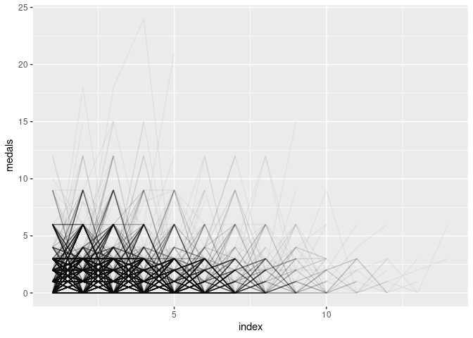
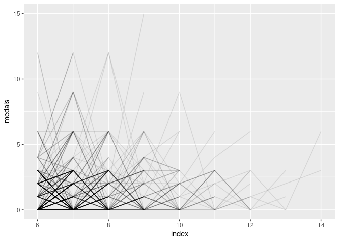
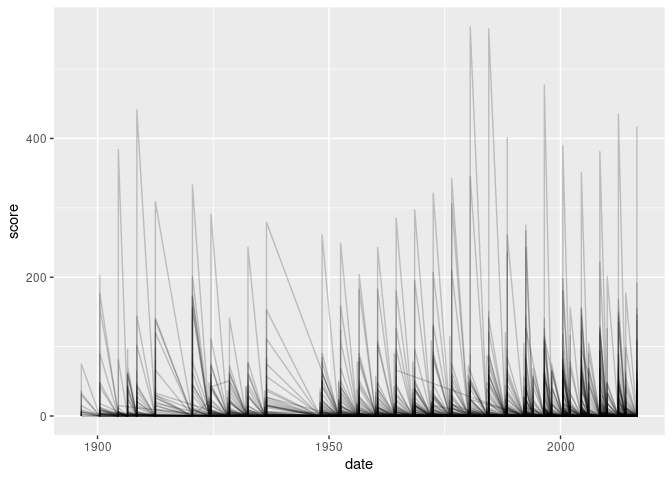

Project proposal
================
Mr. Palmer’s Penguins

``` r
library(tidyverse)
<<<<<<< HEAD
```

    ## Warning in system("timedatectl", intern = TRUE): running command 'timedatectl'
    ## had status 1

``` r
library(lubridate)

# load data from tidytuesday site and write to csv in data folder
readr::read_csv('https://raw.githubusercontent.com/rfordatascience/tidytuesday/master/data/2021/2021-07-27/olympics.csv') %>%
  write_csv(file = "/home/guest/project-01/data/olympics_data.csv")
=======

# load data from tidytuesday site and write to csv in data folder
readr::read_csv('https://raw.githubusercontent.com/rfordatascience/tidytuesday/master/data/2021/2021-07-27/olympics.csv') %>%
  write_csv(file = paste0(here::here(), "/data/olympics_data.csv"))

# read data from csv
olympics <- read_csv(file = paste0(here::here(), "/data/olympics_data.csv"))
>>>>>>> bc2a69f26d23e2c1d1d12ef26a2a736a4dc4c2f7
```

## Sarab

## Drew

This dataset was accessed on Kaggle.com and includes data scraped in May
2018 from Sports Reference/OlympStats, sports statistics sites, by Randi
Griffin, a Senior Data Scientist at Boston Consulting Group.

The set, which includes 15 variables and 271,116 observations, provides
insight into the athletes that competed in and results of the Olympic
games from Athens 1896 to Rio 2016. Each observation includes
information about an athlete on a per event basis. Therefore, if an
athlete competes in multiple different athletic events, there will be
multiple observations with each reflecting an individual event. Each
observation details medal results, the athlete’s background (age, sex,
height, weight, team, etc.), and context about the event (where and when
it was held, season, etc.).

The full list of variables are included here and described below:

``` r
olympics <- read_csv("/home/guest/project-01/data/olympics_data.csv")
```

    ## Rows: 271116 Columns: 15

    ## ── Column specification ────────────────────────────────────────────────────────
    ## Delimiter: ","
    ## chr (10): name, sex, team, noc, games, season, city, sport, event, medal
    ## dbl  (5): id, age, height, weight, year

    ## 
    ## ℹ Use `spec()` to retrieve the full column specification for this data.
    ## ℹ Specify the column types or set `show_col_types = FALSE` to quiet this message.

``` r
glimpse(olympics)
```

    ## Rows: 271,116
    ## Columns: 15
    ## $ id     <dbl> 1, 2, 3, 4, 5, 5, 5, 5, 5, 5, 6, 6, 6, 6, 6, 6, 6, 6, 7, 7, 7, …
    ## $ name   <chr> "A Dijiang", "A Lamusi", "Gunnar Nielsen Aaby", "Edgar Lindenau…
    ## $ sex    <chr> "M", "M", "M", "M", "F", "F", "F", "F", "F", "F", "M", "M", "M"…
    ## $ age    <dbl> 24, 23, 24, 34, 21, 21, 25, 25, 27, 27, 31, 31, 31, 31, 33, 33,…
    ## $ height <dbl> 180, 170, NA, NA, 185, 185, 185, 185, 185, 185, 188, 188, 188, …
    ## $ weight <dbl> 80, 60, NA, NA, 82, 82, 82, 82, 82, 82, 75, 75, 75, 75, 75, 75,…
    ## $ team   <chr> "China", "China", "Denmark", "Denmark/Sweden", "Netherlands", "…
    ## $ noc    <chr> "CHN", "CHN", "DEN", "DEN", "NED", "NED", "NED", "NED", "NED", …
    ## $ games  <chr> "1992 Summer", "2012 Summer", "1920 Summer", "1900 Summer", "19…
    ## $ year   <dbl> 1992, 2012, 1920, 1900, 1988, 1988, 1992, 1992, 1994, 1994, 199…
    ## $ season <chr> "Summer", "Summer", "Summer", "Summer", "Winter", "Winter", "Wi…
    ## $ city   <chr> "Barcelona", "London", "Antwerpen", "Paris", "Calgary", "Calgar…
    ## $ sport  <chr> "Basketball", "Judo", "Football", "Tug-Of-War", "Speed Skating"…
    ## $ event  <chr> "Basketball Men's Basketball", "Judo Men's Extra-Lightweight", …
    ## $ medal  <chr> NA, NA, NA, "Gold", NA, NA, NA, NA, NA, NA, NA, NA, NA, NA, NA,…

`ID` - This is a number assigned uniquely to each athlete. A unique
number associated with each athlete

`Name` - The name of the athlete competing.

`Sex` - Indicated whether the athlete is Male (M) or Female (F)

`Age` - The age of the athlete in years.

`Height` - The height of the athlete in centimeters.

`Weight` - The weight of the athlete in kilograms.

`Team` - The team (country in most cases) the athlete represents.

`NOC` - The 3-letter National Olympic Committee associated wit each team
(country in most cases)

`Games` - The year (1896-2016) and season (Summer or Winter) in which
the event took place. This is a character combination of `Year` and
`Season`. It is important to note that the Summer and Winter games
currently alternate every two years, but used to take place in the same
year.

`Year` - The year (1896-2016) in which the event took place. `Season` -
The season (Summer or Winter) in which the event took place.

`City` - The city in which the Olympic games for that year/season were
hosted.

`Sport` - The sport the athlete is competing in.

`Event` - The event the athlete is competing in.

`Medal` - Indicates whether a Gold, Silver, or Bronze medal was one.
Responses can also take the form NA if no medal was won or there is
incomplete information.

We chose this dataset

The reason why you chose this dataset.

We chose this dataset because we think it can provide a lot of good
insights into some of the trends at the Olympics over the past century
as well as provide strong opportunities for our group to develop our
visualization capabilities.

The Olympics have always been a special global event. Countries from
around the world come together to compete in a range of events. This
share commitment to uniting the global community has time and time
allowed ath Ahtletes = what makes them successful Country information
Historical information about events Outcomes

Evan: These data offer many avenues to explore when analyzing, such as
medalwinning success on an athlete-level scale, on a country-level
scale, for a particular sport over time, etc. Complementing this variety
of potential analysis paradigms is the mixture of variable types. Common
variable types of categorical, ordinal, time-series, and ratio are well
represented in the data. This also affords us the opportunity to
calculate new variables, such as converting the medal variable into a
logical medal winner or non-medal winner.

Diversity of information (categorical and numeric = good for analysis,
opportunities to recode some of the existing variables

  - Just finished the olympics

  - Bringing together the global community, often reflective of broader
    social, cultural, and economic happenings in our world

  - 
Evan: Finally, aside from the properties of the data itself, we chose to
analyze data from the Olympic games due to the recency of the 2020 Tokyo
Games and the role of the Games in reflecting the global culture of a
time period. Historic events like the 1980 Moscow Games that were
boycotted by the US and many other countries, the Games that were
cancelled during the World Wars, and the modern advent of professional
superstar Olympians all potentially provide insights into the story told
by the data.

The two questions you want to answer.

A plan for answering each of the questions including the variables
involved, variables to be created (if any), external data to be merged
in (if any).

<<<<<<< HEAD
## Lilly

ideas: -relationship between GDP etc -which olympics do athletes do best
in (i.e. when they participate in multiple, typical peak performance?)

``` r
olympics %>%
  distinct(id, games) %>%
  group_by(id) %>%
  count() %>%
  arrange(desc(n))
```

    ## # A tibble: 135,571 × 2
    ## # Groups:   id [135,571]
    ##       id     n
    ##    <dbl> <int>
    ##  1 79855    10
    ##  2 65378     9
    ##  3 99155     9
    ##  4 14388     8
    ##  5 26880     8
    ##  6 28051     8
    ##  7 28052     8
    ##  8 32458     8
    ##  9 51618     8
    ## 10 61572     8
    ## # … with 135,561 more rows

``` r
olympics_score <- olympics %>%
  mutate(medal = case_when(
    medal == "Gold" ~ 3,
    medal == "Silver" ~ 2,
    medal == "Bronze" ~ 1,
    TRUE ~ 0),
    date = ifelse(season == "Winter", paste0(year, "-02-01"), paste0(year, "-07-01")),
    date = ymd(date))

olympics_wider <- olympics_score %>%
  group_by(id, date, medal) %>%
  summarize(medals = sum(medal)) %>%
  select(-medal)
```

    ## `summarise()` has grouped output by 'id', 'date'. You can override using the `.groups` argument.

``` r
oly_numb <- olympics_wider %>%
  # number rows within each id to allow for pivoting
  group_by(id) %>%
  mutate(index = row_number()) %>%
  ungroup()
         #event = paste0(date, ", ", medals))

# pivot dates for same id into new columns
oly_numb %>%
  select(id, index, medals) %>%
  tidyr::pivot_wider(names_from = index, values_from = medals) %>%
  colMeans(na.rm = TRUE) %>%
  round(digits = 2) %>%
  knitr::kable()
```

|    |        x |
| :- | -------: |
| id | 67786.00 |
| 1  |     0.27 |
| 2  |     0.58 |
| 3  |     0.70 |
| 4  |     0.94 |
| 5  |     1.10 |
| 6  |     1.29 |
| 7  |     1.55 |
| 8  |     1.58 |
| 9  |     1.71 |
| 10 |     1.47 |
| 11 |     1.71 |
| 12 |     1.43 |
| 13 |     1.20 |
| 14 |     4.50 |

``` r
oly_numb %>%
  count(index)
```

    ## # A tibble: 14 × 2
    ##    index      n
    ##    <int>  <int>
    ##  1     1 135571
    ##  2     2  40528
    ##  3     3  13675
    ##  4     4   4993
    ##  5     5   2022
    ##  6     6    921
    ##  7     7    448
    ##  8     8    231
    ##  9     9    114
    ## 10    10     57
    ## 11    11     28
    ## 12    12     14
    ## 13    13      5
    ## 14    14      2

``` r
ggplot(oly_numb, aes(x = index, y = medals, group = id)) +
  geom_line(alpha = 0.05)
```

<!-- -->

``` r
oly_numb %>%
  filter(index > 5) %>%
  ggplot(aes(x = index, y = medals, group = id)) +
  geom_line(alpha = 0.1)
```

<!-- -->

``` r
popular_sports <- olympics %>%
  count(sport) %>%
  arrange(desc(n)) %>%
  head(7)

woo <- left_join(popular_sports, olympics, by = "sport")
```

``` r
# which sports are the most common crossovers?
# does amt of crossovers differ by country
# heatmap of sports on x and y axis that ppl participate across 

multisport_competitors <- olympics %>%
  distinct(id, sport) %>%
  group_by(id) %>%
  count() %>%
  arrange(desc(n)) %>%
  filter(n > 1) %>%
  left_join(olympics, by = "id")

#multisport_competitors %>%
#  distinct(name, sport) %>%
#  pivot_wider(id_cols = "id", names_from = "sport", values_from = "sport") %>%
#  mutate_all(case_when(
#    str_detect(., "\\d") ~ .,
#    str_detect(., "\\w") ~ 1,
#    TRUE ~ 0))
```

``` r
olympics_score %>%
  group_by(noc, date, medal) %>%
  summarize(score = sum(medal)) %>%
  ggplot(aes(x = date, y = score, group = noc)) +
  geom_line(alpha = .2)
```

    ## `summarise()` has grouped output by 'noc', 'date'. You can override using the `.groups` argument.

<!-- -->

=======
>>>>>>> bc2a69f26d23e2c1d1d12ef26a2a736a4dc4c2f7
## Dataset

A brief description of your dataset including its provenance,
dimensions, etc. as well as the reason why you chose this dataset.

Make sure to load the data and use inline code for some of this
information.

## Questions

The two questions you want to answer.

1.  
## Analysis plan

A plan for answering each of the questions including the variables
involved, variables to be created (if any), external data to be merged
in (if any).

has the success of countries in certain sports changed over the years?

### For Question 2

The original variables we will use to answer this question are **noc**,
**medal**, **sport** (perhaps **event** if some higher granularity
proves informative rather than overwhelming), and **year** and
**season**. Both **year** and **season** are important for placing each
Olympics in time and will require some cleaning in conversion to an
accurate variable **date**. Many of us are familiar with even recent
anomalies in Olympic labeling (such as these recent 2020 Summer
Olympics, which took place in 2021).

Next, we will mutate **medal** from a categorical variable with ‘Gold’,
‘Silver’, ‘Bronze’, and NA as outcomes to either a numeric indicator
(medal = 1 for any win and medal = 0 for no medal received) or a score
that rewards the most points for Gold, then Silver, then Bronze. Through
iterative visualization we will determine whether examining success only
based on medal count or differentiating gold, silver, and bronze
victories allows for a more meaningful display of trends. We will also
later group the observations by region of National Olympic Committee, or
**noc**, which reflects what we understand to be country identities
today than **team** does. Merging in this [secondary
dataset](https://www.kaggle.com/heesoo37/120-years-of-olympic-history-athletes-and-results?select=noc_regions.csv)
provided with the athlete-event level data by Kaggle will allow us to
expand our country labeling from three-letter NOC abbreviations to
complete country names. Additionally, the dataframe in the package
[countrycode](https://vincentarelbundock.github.io/countrycode/) links
countries by their names in various formats to their unicode flag
emojis. Merging this data in will assist us with our visualizations of
this question.

After the above merging and necessary cleaning, we will group the data
by **country**, **sport**, and **date** to compute a new variable called
**medals\_total**. These steps should allow us to begin an initial
approach to visualization, for example, by plotting **medals\_total** on
the y-axis and **date** on the x-axis with lines grouped by **country**
and faceting by **sport**.
