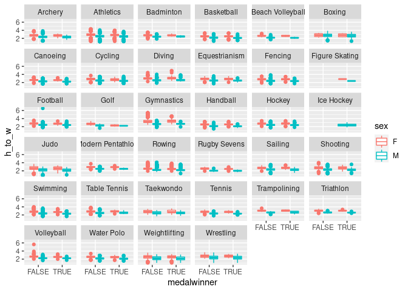
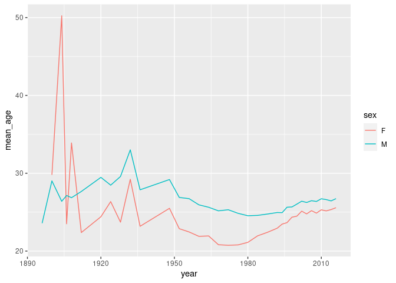
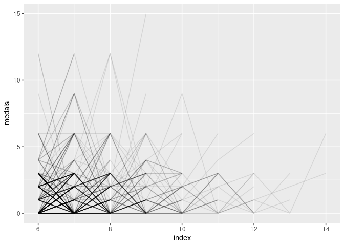

Project proposal
================
Mr. Palmer’s Penguins

``` r
library(tidyverse)
```

    ## Warning in system("timedatectl", intern = TRUE): running command 'timedatectl'
    ## had status 1

``` r
library(lubridate)

# load data from tidytuesday site
olympics <- readr::read_csv('https://raw.githubusercontent.com/rfordatascience/tidytuesday/master/data/2021/2021-07-27/olympics.csv')
```

## Evan

``` r
# Get vector of sports to keep: ie. those that have at least 5 observations per gender
sports_to_keep <- olympics %>%
  group_by(sport, sex) %>%
  summarise(n_per_gender = n()) %>%
  filter(n_per_gender > 5) %>%
  summarise(genders_per_sport = n()) %>%
  filter(genders_per_sport == 2) %>%
  select(sport) %>%
  pull()
```

    ## `summarise()` has grouped output by 'sport'. You can override using the `.groups` argument.

``` r
# Remove all observations from data frame except those from the desired sports we identified above. We also need to remove Croquet and Art Competitions, as those data do not have height or weight measurements.
olympics_evan <- olympics %>%
  filter(sport %in% sports_to_keep) %>%
  filter(!(sport %in% c("Croquet", "Art Competitions")))

# Also im just going to keep summer sports to try to reduce visual overload
olympics_evan <- olympics_evan %>%
  filter(season == "Summer")

# Create new needed variables
olympics_evan <- olympics_evan %>%
  mutate(medalwinner = if_else(is.na(medal), FALSE, TRUE),
         h_to_w = height / weight)

# Create plot to examine height to weight ratios and how they vary between sexes and medalwinners and non-medalwinners, and then comparing these trends across sports
ggplot(olympics_evan, mapping = aes(x = medalwinner, y = h_to_w)) +
  geom_boxplot(aes(color = sex)) +
  facet_wrap(vars(sport))
```

    ## Warning: Removed 50927 rows containing non-finite values (stat_boxplot).

<!-- -->

``` r
#TODOS: see what's going on with ice hockey (looks like only males, and only medalwinners) and figure skating (looks like only medalwinners, but both sexes are still represented.)
```

## Sarab

## Drew

## Lilly

ideas: -relationship between GDP etc -which olympics do athletes do best
in (i.e. when they participate in multiple, typical peak performance?)

``` r
olympics %>%
  distinct(id, games) %>%
  group_by(id) %>%
  count() %>%
  arrange(desc(n))
```

    ## # A tibble: 135,571 × 2
    ## # Groups:   id [135,571]
    ##       id     n
    ##    <dbl> <int>
    ##  1 79855    10
    ##  2 65378     9
    ##  3 99155     9
    ##  4 14388     8
    ##  5 26880     8
    ##  6 28051     8
    ##  7 28052     8
    ##  8 32458     8
    ##  9 51618     8
    ## 10 61572     8
    ## # … with 135,561 more rows

``` r
olympics_wider <- olympics %>%
  mutate(medal = case_when(
    medal == "Gold" ~ 3,
    medal == "Silver" ~ 2,
    medal == "Bronze" ~ 1,
    TRUE ~ 0),
    date = ifelse(season == "Winter", paste0(year, "-02-01"), paste0(year, "-07-01")),
    date = ymd(date)) %>%
  group_by(id, date, medal) %>%
  summarize(medals = sum(medal)) %>%
  select(-medal)
```

    ## `summarise()` has grouped output by 'id', 'date'. You can override using the `.groups` argument.

``` r
oly_numb <- olympics_wider %>%
  # number rows within each id to allow for pivoting
  group_by(id) %>%
  mutate(index = row_number()) %>%
  ungroup()
         #event = paste0(date, ", ", medals))

# pivot dates for same id into new columns
oly_numb %>%
  select(id, index, medals) %>%
  tidyr::pivot_wider(names_from = index, values_from = medals) %>%
  colMeans(na.rm = TRUE) %>%
  round(digits = 2) %>%
  knitr::kable()
```

|    |        x |
| :- | -------: |
| id | 67786.00 |
| 1  |     0.27 |
| 2  |     0.58 |
| 3  |     0.70 |
| 4  |     0.94 |
| 5  |     1.10 |
| 6  |     1.29 |
| 7  |     1.55 |
| 8  |     1.58 |
| 9  |     1.71 |
| 10 |     1.47 |
| 11 |     1.71 |
| 12 |     1.43 |
| 13 |     1.20 |
| 14 |     4.50 |

``` r
oly_numb %>%
  count(index)
```

    ## # A tibble: 14 × 2
    ##    index      n
    ##    <int>  <int>
    ##  1     1 135571
    ##  2     2  40528
    ##  3     3  13675
    ##  4     4   4993
    ##  5     5   2022
    ##  6     6    921
    ##  7     7    448
    ##  8     8    231
    ##  9     9    114
    ## 10    10     57
    ## 11    11     28
    ## 12    12     14
    ## 13    13      5
    ## 14    14      2

``` r
ggplot(oly_numb, aes(x = index, y = medals, group = id)) +
  geom_line(alpha = 0.05)
```

<!-- -->

``` r
oly_numb %>%
  filter(index > 5) %>%
  ggplot(aes(x = index, y = medals, group = id)) +
  geom_line(alpha = 0.1)
```

<!-- -->

## Dataset

A brief description of your dataset including its provenance,
dimensions, etc. as well as the reason why you chose this dataset.

Make sure to load the data and use inline code for some of this
information.

## Questions

The two questions you want to answer.

## Analysis plan

A plan for answering each of the questions including the variables
involved, variables to be created (if any), external data to be merged
in (if any).
